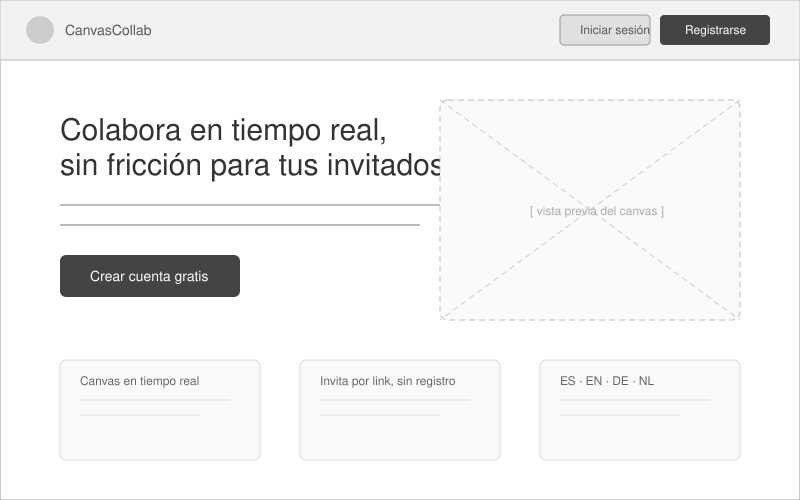
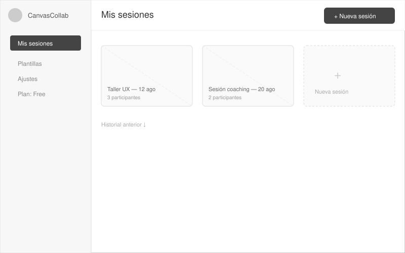
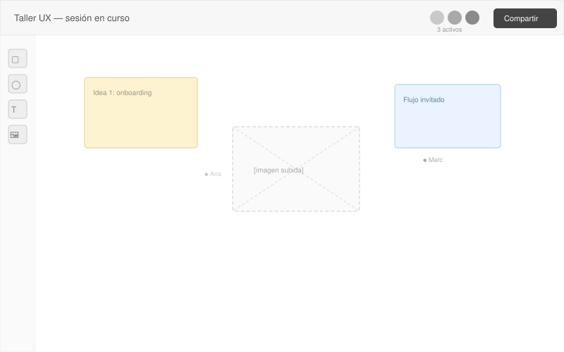
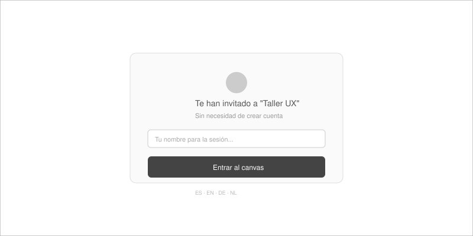

# 1. Descripción general del producto

---

## 1.1. Objetivo

**Propósito:** ofrecer una plataforma web donde cualquier profesional que necesite facilitar sesiones visuales colaborativas (coaching, formación, talleres de diseño, dinámicas de equipo) pueda crear en segundos un **canvas compartido** —con imágenes, figuras y notas— e invitar a otras personas a verlo y editarlo en tiempo real **sin que estas últimas necesiten registrarse**, solo con un link.

**Qué soluciona:**
- La fricción de herramientas de pizarra colaborativa que obligan a *todos* los participantes a crear cuenta antes de poder colaborar.
- La dispersión de materiales visuales de una sesión (imágenes, notas, diagramas) que hoy se reparten entre email, chat y capturas de pantalla.
- La necesidad de un espacio ligero, multi-idioma, que un facilitador pueda montar y compartir en minutos, sin curva de aprendizaje para el invitado.

**Para quién (segmentos objetivo):**
- Coaches y facilitadores individuales (referencia de mercado: coachingspace.net).
- Formadores y educadores que dinamizan talleres online.
- Equipos pequeños de diseño/UX que necesitan un espacio visual puntual con clientes externos.

**Valor aportado:** el anfitrión se registra una vez y gestiona sus sesiones; cada invitado entra con un solo clic, sin cuenta, lo que reduce drásticamente la fricción de adopción y favorece el efecto viral (cada invitado ve la marca y puede convertirse en usuario registrado).

---

## 1.2. Características y funcionalidades principales

> El MVP se divide en dos sub-fases para reducir riesgo y validar el producto antes de afrontar la parte más compleja (edición colaborativa en tiempo real). Ver justificación de tiempo/coste/dificultad en 1.12 y 1.13.

### MVP-A — Canvas individual + link para compartir (lanzamiento inicial)
- **Registro/login** de anfitriones (email + Google OAuth).
- **Creación de canvas**: formas, texto, imágenes, notas adhesivas — edición únicamente por el anfitrión.
- **Link para compartir**, sin registro del invitado: el invitado **ve** el canvas (última versión guardada), no lo edita.
- **Control del link**: el anfitrión puede revocar o cerrar el acceso en cualquier momento.
- **Selector de idioma**: Español, Inglés, Alemán y Neerlandés — tanto para el anfitrión como para el invitado.
- **Exportación del canvas** a PNG/PDF.
- **Panel "Mis sesiones"** para el usuario registrado (historial, acceso rápido, estado).

### MVP-B — Conversión a canvas colaborativo en tiempo real
- **Edición en tiempo real multi-cursor**: el invitado pasa de "ver" a "ver y editar" el canvas en vivo.
- **Guardado de canvases** del documento sincronizado (CRDT).
- **Indicadores de presencia**: cursores y avatares de participantes activos.
- **Toggle de permisos por link**: el anfitrión decide si el link es de solo lectura o de edición (algunos casos de uso seguirán prefiriendo solo-lectura).
- **Testing de concurrencia** (varios usuarios editando a la vez, reconexión, resolución de conflictos).

### Fase 2 (post-MVP-B)
- Plantillas de canvas prediseñadas.
- Roles de permisos por participante (editor / solo lectura), más granulares.
- Historial de versiones del canvas.
- Chat dentro de la sesión.
- Planes de pago y facturación (Stripe).
- Panel de analítica de uso para el anfitrión.

### Fase 3 (escala)
- Marca blanca / dominio propio para clientes de plan Team.
- Integraciones (calendario, Zoom/Meet, Slack).
- API pública.
- Cuentas de organización/equipo (no solo individuales).

### Requisito transversal — diseño responsive
Aplica a **todas las fases** (MVP-A, MVP-B y siguientes), no es una feature aislada:
- La interfaz (landing, registro, panel "Mis sesiones", vista de canvas) debe funcionar correctamente en **desktop, tablet y móvil**, con un enfoque *mobile-first* en el desarrollo del frontend.
- El **canvas en sí** debe ser usable con gestos táctiles (pinch-to-zoom, arrastrar con el dedo) — tanto tldraw como Fabric.js soportan entrada táctil de forma nativa, por lo que no requiere desarrollo adicional significativo, pero sí **testing específico en tablet/móvil** antes de cada lanzamiento.
- El flujo del **invitado sin registro** es el más sensible a esto: muchos invitados abrirán el link desde el móvil (p. ej. durante una sesión de coaching por videollamada), así que su UX debe validarse primero en pantallas pequeñas.
---

## 1.3. Diseño y experiencia de usuario

> Aún no existe UI construida — los siguientes son **wireframes de baja fidelidad** que ilustran el recorrido principal del usuario. Se recomienda sustituirlos por capturas reales y/o un vídeo de producto una vez desarrollado el MVP.

**Recorrido 1 — Aterrizaje y registro del anfitrión**

El anfitrión llega a la landing, entiende la propuesta de valor (colaboración en tiempo real sin fricción para invitados) y se registra.



**Recorrido 2 — Panel "Mis sesiones"**

Tras iniciar sesión, el anfitrión ve sus sesiones existentes y puede crear una nueva con un clic.



**Recorrido 3 — Canvas colaborativo**

Dentro de una sesión, el anfitrión (y los invitados conectados) trabajan sobre el canvas compartido: herramientas de forma/texto/imagen a la izquierda, avatares de participantes activos arriba a la derecha, y botón de "Compartir" para generar el link de invitado.



**Recorrido 4 — Acceso del invitado (sin registro)**

Al abrir el link, el invitado solo introduce un nombre para mostrarse en la sesión y entra directamente al canvas — sin contraseña, sin email.




---

## 1.4. Instrucciones de instalación

Instrucciones para levantar el proyecto **en local**, conectando contra un **proyecto Supabase de staging en la nube** (no se requiere base de datos local — el backend es gestionado).

### Requisitos previos
- Node.js ≥ 20.x y npm o pnpm
- Git
- Cuenta de Supabase (proyecto de staging ya creado por el equipo, o uno propio de desarrollo)
- Supabase CLI (`npm install -g supabase`)
- Cuenta de Vercel (opcional, solo si se quiere probar el despliegue en preview)

### 1. Clonar el repositorio
```bash
git clone https://github.com/<org>/canvas-collab.git
cd canvas-collab
```

### 2. Instalar dependencias
```bash
npm install
# o
pnpm install
```

### 3. Variables de entorno
Copiar el archivo de ejemplo y rellenar con las credenciales del proyecto Supabase de **staging**:
```bash
cp .env.example .env.local
```

`.env.local`:
```
NEXT_PUBLIC_SUPABASE_URL=https://<proyecto-staging>.supabase.co
NEXT_PUBLIC_SUPABASE_ANON_KEY=<anon-key-de-staging>
SUPABASE_SERVICE_ROLE_KEY=<service-role-key-de-staging>   # solo backend, nunca en el cliente
NEXT_PUBLIC_LIVEBLOCKS_PUBLIC_KEY=<clave-liveblocks-dev>
RESEND_API_KEY=<clave-emails-dev>
NEXT_PUBLIC_DEFAULT_LOCALE=es
```

### 4. Vincular la CLI de Supabase al proyecto de staging (remoto)
```bash
supabase login
supabase link --project-ref <project-ref-staging>
```

### 5. Migraciones de base de datos
Las migraciones viven en `supabase/migrations/` y se aplican contra el proyecto remoto de staging:
```bash
supabase db push
```

### 6. Semillas de datos (seeds)
```bash
supabase db execute -f supabase/seed.sql
```
Esto crea: un usuario de prueba, una sesión de ejemplo con 3 objetos en el canvas, y los textos de i18n base en ES/EN/DE/NL.

### 7. Arrancar el servidor de desarrollo
```bash
npm run dev
```
La app queda disponible en `http://localhost:3000`.

### 8. Verificación
- Login con el usuario semilla (ver credenciales en `supabase/seed.sql` o en el README del repo).
- Crear una sesión nueva desde "Mis sesiones".
- Copiar el link de invitado y abrirlo en una ventana de incógnito → debe entrar sin login.
- Cambiar el idioma desde el selector y comprobar que persiste.

### Comandos útiles adicionales
| Comando | Descripción |
|---|---|
| `npm run lint` | Linter del proyecto |
| `npm run test` | Tests unitarios |
| `supabase db reset` | Resetea staging a estado limpio + reseeds (⚠️ solo en staging) |
| `npm run build && npm run start` | Prueba del build de producción en local |

> **Importante:** nunca apuntar `.env.local` al proyecto Supabase de **producción**. El de staging es el único entorno permitido para desarrollo local, conforme a la política de entornos (ver 1.8).

---

## 1.5. Modelo de negocio

Modelo Freemium, con un add-on de pay-per-session preparado en el diseño pero no activo en el lanzamiento.

Freemium (modelo activo desde el lanzamiento):

Plan gratuito con límites (nº de sesiones/canvases al mes, nº de participantes por sesión, almacenamiento).
Plan(es) de pago (Pro / Team) que desbloquean: historial completo, marca blanca, más participantes, integraciones.
Genera bajo CAC gracias al link a no-registrados, que actúa como canal de adquisición viral (cada invitado ve la marca y puede convertirse en usuario registrado).

Pay-per-session (add-on, diseñado pero no activo):

Pensado para clientes de uso esporádico (coaches, formadores) que solo necesitan la plataforma puntualmente y para quienes una suscripción no encaja.
Se deja preparado a nivel de arquitectura (capa de planes/límites con feature flags, ver 1.14 — riesgos) para poder activarlo más adelante sin rediseñar el sistema de facturación, pero no se lanza ni se comunica en la v1.

---

## 1.6. North Star Metric y KPIs

### North Star Metric
> **Sesiones colaborativas activas semanales con ≥2 participantes conectados simultáneamente**

Captura el valor central del producto (colaboración real, no solo registro o uso en solitario), correlaciona con retención y con potencial viral.

**Métrica interina durante MVP-A** (sin edición en vivo todavía): *canvases compartidos y vistos por al menos un invitado / semana*. Mide la misma intención de fondo — ¿la gente usa el link para compartir con otros? — sin exigir aún colaboración simultánea. Sirve como señal de validación antes de invertir en la conversión a MVP-B.

### KPIs por categoría

**Activación**
- % de registrados que crean su primera sesión en <7 días
- Tiempo medio hasta primera sesión creada

**Engagement / Retención**
- Sesiones colaborativas por usuario registrado / mes
- Nº medio de participantes invitados por sesión
- Retención D7 / D30
- % de invitados que se registran después (conversión viral)

**Monetización**
- MRR / ARR
- Tasa de conversión free → pago
- Ratio LTV:CAC (objetivo ≥ 3:1)
- Churn mensual
- ARPU

**Salud técnica/negocio**
- Uptime (objetivo ≥99.5%)
- Latencia de sincronización del canvas (objetivo <200ms p95)
- Coste de infraestructura por usuario activo

---

## 1.7. Arquitectura técnica

Contexto de decisión: fundador único apoyado en herramientas IA/low-code → se prioriza *managed services* sobre infraestructura propia.

| Capa | Recomendación | Motivo |
|---|---|---|
| Frontend | **Next.js (React)** en **Vercel**, con diseño **responsive mobile-first** (breakpoints desktop / tablet / móvil) | Despliegues automáticos por rama, previews por PR, CDN global; la UI debe adaptarse a los 3 tamaños de pantalla (ver requisito transversal en 1.2) |
| Canvas | **tldraw**, usado en modo local (sin sincronización) en MVP-A | Motor de canvas ya construido, con soporte táctil nativo (tablet/móvil); ahorra semanas de desarrollo. En MVP-A el guardado es un CRUD simple (JSON del canvas en Supabase) |
| Tiempo real *(solo se incorpora en MVP-B)* | **`tldraw sync`**, autohospedado en **Cloudflare Workers + Durable Objects** (plantilla oficial `tldraw-sync-cloudflare`, MIT) | Motor de sincronización construido específicamente para tldraw (no CRDT genérico como Yjs, sino un modelo push/pull/rebase optimizado para canvas); incluye presence, cursores en vivo y roles editor/viewer de fábrica — el mismo sistema que usa tldraw.com en producción. Alternativa sin gestionar infraestructura propia: **Liveblocks** (SaaS, más caro por conexión) |
| Backend / Auth / DB | **Supabase** (Postgres + Auth + Storage + Realtime, región Frankfurt) | Auth lista, almacenamiento de imágenes, y **dato alojado en la UE** — clave para GDPR |
| Pagos (fase 2) | **Stripe** | Estándar, gestiona impuestos UE (Stripe Tax) |
| Emails transaccionales | **Resend** o Postmark | Sencillo y económico a esta escala |
| Monitorización | **Sentry** (tier free) | Detección temprana de errores sin infra dedicada |

**MVP-A**: stack más simple (sin capa de sincronización), entra cómodamente en los tiers gratuitos/entrada — **coste estimado 25–35 €/mes**.
**MVP-B** (con `tldraw sync` en Cloudflare): **coste estimado 61–86 €/mes** — más barato que la alternativa Liveblocks (~76–106 €/mes) porque Cloudflare cobra por uso real y a nuestra escala (5 concurrentes) se mueve dentro del tier de entrada. Contrapartida: añade **Cloudflare** como tercer proveedor de infraestructura autogestionado (junto a Vercel + Supabase), frente al modelo 100% SaaS de Liveblocks. Ver desglose completo en 1.12 y 1.13.
---

## 1.8. Entornos: Preproducción y Producción

| | Preproducción | Producción |
|---|---|---|
| Rama Git | `develop` / `staging` | `main` |
| Vercel | Proyecto/entorno "Preview" o `app-staging` | Proyecto `app` (dominio final) |
| Supabase | Proyecto independiente `proyecto-staging` | Proyecto independiente `proyecto-prod` (datos reales) |
| Datos | Ficticios, se puede resetear libremente | Reales — sujeto a GDPR, backups obligatorios |
| CI/CD | GitHub Actions: push a `develop` → deploy automático + tests | Merge a `main` → deploy tras aprobación manual (gate) |

**Flujo:** feature branch → PR con preview automático → merge a `develop` (staging) → validación manual → merge a `main` (producción).

---

## 1.9. GDPR (RGPD)

1. **Residencia de datos**: Supabase en región UE (Frankfurt); evitar transferencias fuera del EEE salvo con garantías (SCCs).
2. **Base legal**: consentimiento explícito en registro; para invitados, interés legítimo limitado (solo nombre visible, sin perfilado).
3. **Minimización de datos**: invitados sin registro solo aportan un nombre para mostrar — nada más.
4. **Derechos ARCO-POL**: flujo de "descargar mis datos" y "eliminar mi cuenta" desde el propio perfil.
5. **Registro de actividades de tratamiento (RAT)**.
6. **DPA** con cada proveedor (Supabase, Vercel, Cloudflare, Stripe, Resend).
7. **Cookies**: banner (solo técnicas necesarias en MVP; opt-in real si se añade analítica).
8. **Política de privacidad y T&C** en los 4 idiomas, revisadas por un profesional legal.
9. **Retención de datos**: borrado automático de sesiones inactivas tras un periodo definido.
10. **DPO**: no obligatorio a esta escala, pero conviene un punto de contacto de privacidad claro.
11. **Notificación de brechas**: procedimiento para notificar a la autoridad correspondiente en 72h.

---

## 1.10. Ciberseguridad

| Área | Medida |
|---|---|
| Autenticación | OAuth (Google) + email/password (Supabase Auth); 2FA opcional fase 2 |
| Enlaces de invitado | Tokens UUID v4 no adivinables, con expiración y revocación inmediata |
| Autorización | Row Level Security (RLS) de Postgres/Supabase |
| Transporte | HTTPS/TLS en todo el tráfico |
| Cifrado en reposo | Activado por defecto en Supabase |
| Validación de entrada | Sanitización de contenido subido (XSS/inyección), límites de tamaño |
| Rate limiting | Límite de peticiones por IP/usuario en endpoints públicos |
| Gestión de secretos | Variables de entorno, nunca en el repo; rotación periódica |
| Dependencias | Escaneo automático (Dependabot) en cada PR |
| Backups | Automáticos diarios en producción, con pruebas de restauración |
| Antes del lanzamiento | Checklist OWASP Top 10 / pentest ligero |
| Respuesta a incidentes | Procedimiento: detección → contención → comunicación → notificación GDPR si aplica |

---

## 1.11. Internacionalización (ES / EN / DE / NL)

- Librería recomendada: **next-intl**.
- Todo el contenido (UI, emails transaccionales, páginas legales) debe existir en los 4 idiomas desde el MVP.
- Detección de idioma por navegador + selector manual, con preferencia guardada en el perfil.
- Los invitados sin registro también pueden elegir idioma vía el link.

---

## 1.12. Roadmap por fases

> Estrategia recomendada: lanzar primero **MVP-A** (canvas individual + link de solo lectura) para validar el producto con menor coste, tiempo y riesgo técnico; convertir a **MVP-B** (colaborativo en tiempo real) solo si hay señal de tracción real.

### Fase MVP-A

| Fase | Duración estimada (1 persona + IA) | Entregable |
|---|---|---|
| 0. Discovery & diseño | 2–3 semanas | Wireframes, flujo de usuario, MVP-A definido, contratos legales base |
| 1. Setup técnico | 1 semana | Repos, Supabase (staging+prod), Vercel, CI/CD |
| 2. Desarrollo MVP-A | **3–4 semanas** | Auth, canvas individual, guardado CRUD, link de invitado (solo lectura), i18n |
| 3. QA + seguridad | 1–2 semanas | Pruebas funcionales, checklist OWASP, revisión GDPR |
| 4. Beta cerrada | 2–4 semanas | 20–50 usuarios reales, feedback, validación de la métrica interina (1.6) |
| 5. Lanzamiento público MVP-A | — | Apertura a los 500 usuarios objetivo |
| **Total hasta lanzamiento MVP-A** | **≈ 9–12 semanas** | |

### Fase de conversión a MVP-B (solo si hay tracción validada)

| Tarea | Duración estimada |
|---|---|
| Integrar Yjs + Liveblocks (sincronización) | 2–3 semanas |
| Migración de canvases existentes a formato colaborativo | 0.5–1 semana (incluye script de migración + pruebas para no perder contenido real) |
| UI de presencia (cursores, avatares activos) + toggle de permisos por link | 1 semana |
| Testing de concurrencia (multi-usuario, reconexión, conflictos) | 1 semana |
| **Total conversión a MVP-B** | **≈ 4–6 semanas** |

**Dificultad de la conversión:** 🟠 media-alta — es la parte de mayor riesgo técnico del proyecto, pero se afronta con producto ya validado y usuarios reales, no a ciegas.

### Fase 2 y 3 (post MVP-B)
Continúan igual que en el plan original: planes de pago, permisos avanzados, plantillas, marca blanca, integraciones, API pública (iteración continua).

---

## 1.13. Presupuesto estimado de herramientas

| Servicio | MVP-A (sin sincronización) | MVP-B (con `tldraw sync` en Cloudflare) |
|---|---|---|
| Vercel (Pro) | ~20 € | ~20 € |
| Supabase (Pro) | ~25 € | ~25 € |
| Cloudflare Workers Paid (requerido para Durable Objects) | — | ~5 € |
| Cloudflare R2 (imágenes/vídeos del canvas) | — | ~0 € (dentro del tier gratuito de 10 GB a nuestra escala) |
| Dominio | ~1 €/mes (anual) | ~1 €/mes (anual) |
| Sentry (free) | 0 € | 0 € |
| Resend/Postmark (inicial) | 0–15 € | 0–15 € |
| Herramienta legal (Iubenda/Termly) | ~10–15 € | ~10–15 € |
| **Total estimado/mes** | **~25–35 €** | **~61–86 €** |

**Coste único de conversión** (desarrollo, no infra recurrente): 4–6 semanas de trabajo — ver 1.12. No implica coste de licencias adicional aparte de Liveblocks.

**Resumen de la comparativa MVP-A vs. lanzar MVP-B directo:**

| | Lanzar MVP-A y convertir después | Lanzar MVP-B directo |
|---|---|---|
| Tiempo hasta primer lanzamiento | 9–12 semanas | 13–20 semanas |
| Tiempo total acumulado (si se convierte) | 13–18 semanas | 13–20 semanas |
| Coste infra hasta validar | 25–35 €/mes | 55–100 €/mes desde el día 1 |
| Riesgo técnico asumido antes de tener usuarios reales | Bajo | Medio-alto |
| Ventaja principal | Validar demanda antes de invertir en la parte más compleja | Producto "completo" desde el lanzamiento, sin fase de migración |

---

## 1.14. Riesgos principales y mitigación

| Riesgo | Mitigación |
|---|---|
| Complejidad del canvas en tiempo real subestimada | Usar `tldraw sync` (motor de sincronización ya construido y probado en producción por tldraw.com), no construir un motor de sync propio desde cero |
| Incumplimiento GDPR por prisas de lanzamiento | Checklist GDPR como gate obligatorio antes de producción real |
| Un único desarrollador = punto único de fallo | Documentar todo para poder incorporar ayuda externa rápidamente |
| Adopción baja por fricción de registro | El invitado sin registro ya mitiga esto — mantenerlo como pilar |
| Cambios de modelo de negocio a mitad de proyecto | Diseñar la capa de planes/límites desde el principio (feature flags) |
| Experiencia degradada en tablet/móvil (canvas complejo en pantalla pequeña) | Diseño mobile-first desde los wireframes (1.2, 1.3), testing en dispositivos reales antes de cada beta, no solo en emulador de navegador |
---
*Documento vivo — revisar tras la fase de Discovery y con datos reales de la beta cerrada.*
