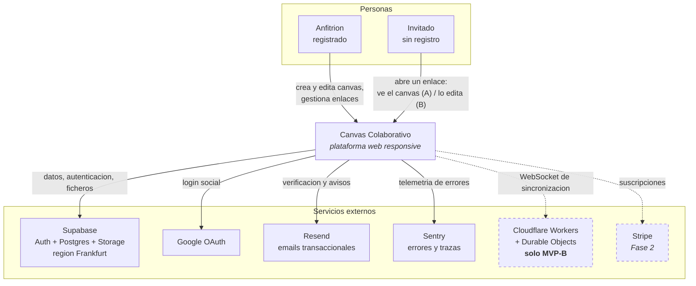
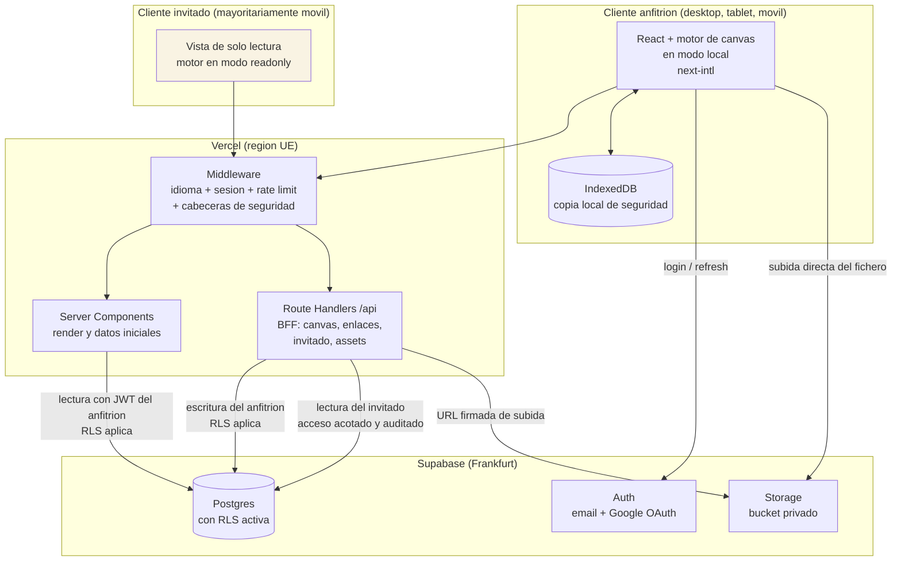
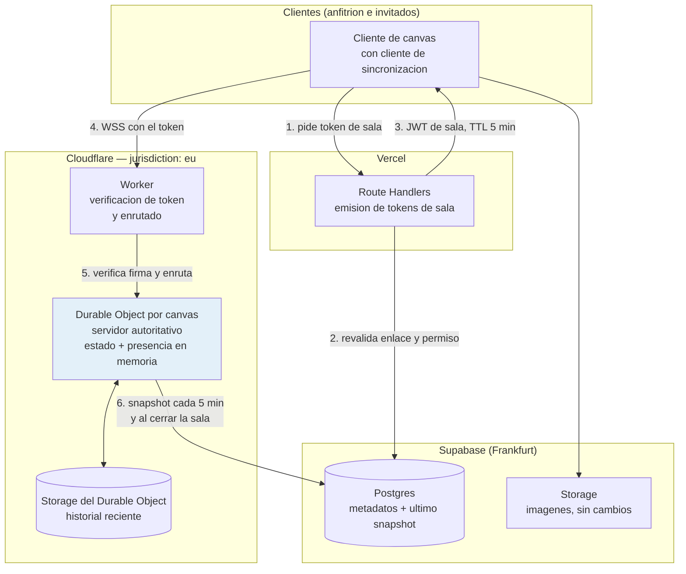
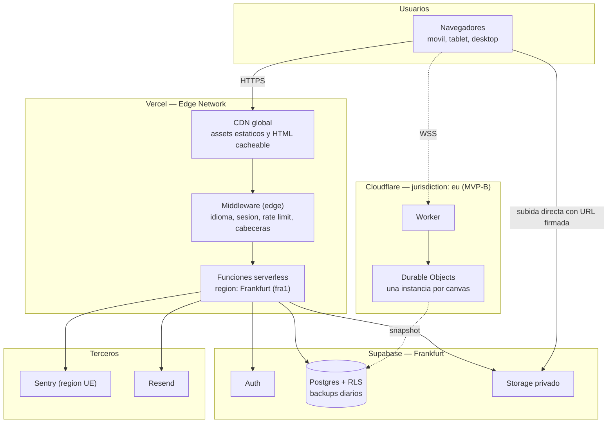
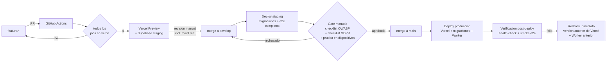
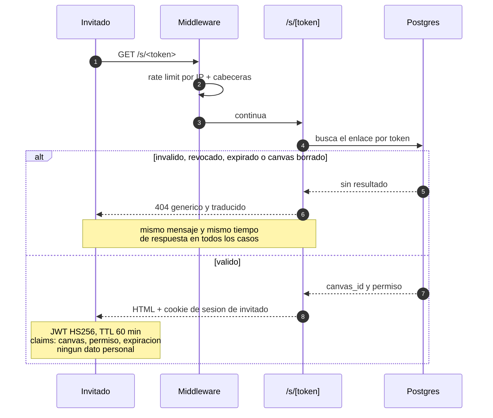

# 2. Arquitectura del Sistema

> Documento derivado de `1-descripcion-general-del-producto.md`.
> Cubre **MVP-A** (canvas individual con enlace de solo lectura), **MVP-B** (colaborativo en tiempo real) y la transición entre ambos.
> El modelo de datos se documenta aparte.

---

## Decisiones previas que condicionan toda la arquitectura

Antes de los diagramas, las decisiones tomadas y su motivo. Cada una se justifica en la sección correspondiente.

| ID | Decisión | Alternativas descartadas | Motivo |
|---|---|---|---|
| ADR-01 | **El motor de canvas vive detrás de un adaptador propio** (`CanvasEngine`). Ningún componente de la aplicación importa el SDK directamente | Acoplar tldraw a la UI | La licencia del SDK es una variable abierta; el adaptador convierte un cambio de motor en un módulo nuevo, no en una reescritura |
| ADR-02 | **Licencia *hobby* de tldraw (gratuita, con marca de agua) durante toda la fase privada.** Clave comercial solo antes del lanzamiento público con ingresos | Comprar licencia comercial desde el día 1 | Coste cero mientras el producto no genera ingresos. En desarrollo local el SDK no necesita clave; para el entorno privado en HTTPS se solicita la clave hobby |
| ADR-03 | **`tldraw sync` autohospedado en Cloudflare Workers + Durable Objects** para MVP-B | Liveblocks; Yjs con servidor propio | Liveblocks factura por usuario activo mensual y el modelo de negocio consiste en maximizar invitados anónimos; además no permite autohospedaje ni residencia UE garantizada |
| ADR-04 | **Patrón BFF: el invitado nunca habla directamente con Supabase.** Su identidad es un JWT de sesión efímero en cookie HttpOnly, sin registro en base de datos | Supabase Anonymous Auth; exponer la `anon key` al invitado | Cero datos personales almacenados, un único punto de control de autorización, y la vista del invitado no necesita banner de cookies |
| ADR-05 | **Un solo almacenamiento de ficheros: Supabase Storage (Frankfurt)**, también en MVP-B | Cloudflare R2 | Coherencia con el requisito de residencia UE y un proveedor menos que auditar |
| ADR-06 | **Persistencia tras una interfaz `CanvasStore`** desde el primer día | Escribir contra la API desde los componentes | Es la pieza que hace barata la conversión a MVP-B: cambiar de implementación, no de aplicación |
| ADR-07 | **Mobile-first real: el flujo del invitado se diseña y se valida primero en móvil** | Diseñar en desktop y adaptar | Muchos invitados abrirán el enlace desde el móvil durante una videollamada; es la ruta que decide la adopción |
| ADR-08 | **Exportación PNG/PDF íntegramente en cliente** | Servicio headless de renderizado | Cero infraestructura, cero coste y ningún contenido del canvas sale del navegador |

### Nota sobre la licencia (ADR-02)

Condiciones que hay que respetar para que la estrategia sea sostenible:

- **En desarrollo no hace falta clave.** El SDK detecta entorno de desarrollo por protocolo y host: `localhost` o HTTP es desarrollo. Todo el trabajo local es gratuito y sin marca de agua.
- **En la fase privada (staging con dominio propio en HTTPS, beta cerrada con usuarios invitados) sí hace falta clave.** Se solicita la licencia *hobby*, que es gratuita y **mantiene visible la marca de agua "made with tldraw"** en el canvas y en las exportaciones. Es discrecional: la concede el equipo de tldraw caso por caso, así que conviene solicitarla al inicio del proyecto y no la semana antes de necesitarla.
- **En cuanto haya cobro a usuarios, la licencia hobby deja de ser aplicable** y hay que pasar a licencia comercial o a otro motor. Ese es el momento de decisión, no antes.
- **Consecuencia de producto durante la fase privada:** las exportaciones PNG/PDF llevarán marca de agua. Hay que decirlo a los usuarios de la beta y no venderlo como funcionalidad terminada.
- **Alternativa preparada:** ADR-01 mantiene abierta la puerta a Excalidraw (licencia MIT, sin marca de agua ni clave) si la decisión comercial resulta inviable.

---

## 2.1. Diagrama de arquitectura

### 2.1.1. Patrón arquitectónico

El sistema combina tres patrones bien establecidos, cada uno aplicado donde aporta:

1. **Monolito modular sobre Jamstack** (Next.js App Router desplegado en Vercel). Una sola aplicación, un solo repositorio, un solo despliegue. No hay microservicios porque no hay equipos que separar: con un desarrollador, cada frontera de red es un coste sin contrapartida.
2. **Backend for Frontend (BFF)**. Los Route Handlers de Next.js son la única puerta al backend para el flujo anónimo. El invitado nunca recibe credenciales de Supabase, lo que reduce la superficie de ataque a un conjunto pequeño de endpoints auditables.
3. **Puertos y adaptadores (hexagonal ligero)** aplicado a dos puntos concretos, no a todo el código: el **motor de canvas** (`CanvasEngine`) y la **persistencia del documento** (`CanvasStore`). Son exactamente las dos piezas con más incertidumbre del proyecto: la primera por licencia, la segunda porque cambia entre MVP-A y MVP-B. El resto de la aplicación se escribe de forma directa, sin capas de abstracción especulativas.

A esto se añade, solo en MVP-B, un **servicio de estado con afinidad por sala**: un Durable Object por canvas que actúa como servidor autoritativo de la sincronización.

### 2.1.2. Vista de contexto



Las líneas discontinuas son lo que aún no existe. MVP-A se entrega con cuatro servicios externos, todos en plan gratuito o de entrada.

### 2.1.3. Vista de contenedores — MVP-A



Tres detalles que suelen malinterpretarse:

- **El invitado no recibe ninguna credencial de Supabase**, ni siquiera la clave pública anónima. Su navegador solo habla con el CDN de Vercel y con `/api`.
- **El anfitrión sí habla directamente con Supabase** para autenticación y lecturas, con RLS como barrera. Las escrituras pasan por `/api` porque ahí viven las validaciones de límites de plan.
- **Las imágenes suben directas del navegador a Storage** con URL firmada. No atraviesan la función serverless, que tiene límite de tamaño de payload.

### 2.1.4. Vista de contenedores — MVP-B

Delta sobre lo anterior; todo lo de MVP-A sigue existiendo.



**Por qué un Durable Object por canvas:** es una instancia única, direccionable globalmente y con estado en memoria. Todos los participantes de un canvas se conectan a la misma instancia, que arbitra el orden de los cambios. No hay que resolver consenso entre servidores porque, para esa sala, solo hay un servidor.

**Dónde está la verdad en MVP-B:** en el Durable Object mientras la sala vive; Postgres recibe una copia derivada. Esto importa para las miniaturas del panel, para la exportación y sobre todo para el borrado GDPR, que debe alcanzar los dos sitios.

### 2.1.5. Justificación

| Decisión | Por qué esta y no otra |
|---|---|
| Monolito modular en vez de microservicios | Un desarrollador único. Cada servicio adicional multiplica despliegues, observabilidad y modos de fallo sin resolver ningún problema real a esta escala |
| Servicios gestionados en vez de infraestructura propia | No hay equipo de guardia. La única excepción (el Worker) se justifica porque no existe equivalente gestionado que encaje con el modelo de negocio |
| BFF en vez de exponer la base de datos al cliente anónimo | El flujo del invitado es público por diseño; concentrarlo en pocos endpoints permite auditarlo de verdad |
| Puertos y adaptadores solo en dos puntos | La abstracción tiene coste. Se paga donde hay incertidumbre real (licencia del motor, cambio de persistencia) y no donde no la hay |
| Renderizado híbrido (Server Components + cliente) | La vista del invitado necesita ser rápida en móvil con red mala: se sirve HTML con los datos ya dentro. El editor es intrínsecamente cliente |
| Servidor autoritativo en vez de CRDT genérico | El motor de sincronización elegido usa un modelo push/pull/rebase específico para este canvas, con presencia y roles de fábrica. Un CRDT genérico obligaría a escribir y mantener la traducción entre modelos, que es donde aparecen los fallos difíciles de concurrencia |

### 2.1.6. Beneficios y sacrificios

**Beneficios**

- **Tiempo hasta el lanzamiento.** Autenticación, base de datos, almacenamiento y CDN son configuración, no desarrollo. El esfuerzo se concentra en el canvas y en el flujo de invitado, que es donde está el producto.
- **Coste de operación bajo y predecible**: del orden de 25–35 €/mes en MVP-A y 56–81 €/mes en MVP-B.
- **Superficie de ataque pequeña.** No hay servidores propios que parchear en MVP-A, ni puertos abiertos, ni sistema operativo que mantener.
- **Cumplimiento normativo por diseño**: dato en la UE en todos los proveedores, y ningún dato personal del invitado almacenado en ningún momento.
- **Reversibilidad en los dos puntos de mayor riesgo**: se puede cambiar de motor de canvas y de estrategia de sincronización sin tocar la aplicación.
- **Un solo despliegue que razonar.** Con un desarrollador, entender el sistema completo en la cabeza es una ventaja operativa real.

**Sacrificios asumidos conscientemente**

| Sacrificio | Por qué se acepta | Cómo se mitiga |
|---|---|---|
| **Dependencia fuerte de Supabase.** Auth, datos y ficheros en un solo proveedor | El coste de la independencia (montar auth propia) es mucho mayor que el riesgo | Postgres es estándar y exportable; solo Auth tendría coste real de migración |
| **Escalado vertical de la base de datos.** Sin sharding ni réplicas de lectura | A la escala objetiva (500 usuarios) sobra de largo | El plan de Supabase se escala con un clic hasta órdenes de magnitud por encima |
| **El BFF salta la RLS en el flujo de invitado.** La autorización de ese camino vive en código, no en la base de datos | Es lo que permite no almacenar nada del invitado | Módulo único, corto, con cobertura de tests del 100 % y revisión reforzada (§2.5) |
| **Cloudflare como tercer proveedor en MVP-B**, con infraestructura propia que operar | Diez veces más barato y alineado con el modelo de negocio | Plantilla oficial, despliegue desde CI, y ruta de degradación a modo local probada |
| **Arranque en frío de funciones serverless** en picos de baja actividad | Impacto de decenas de milisegundos, irrelevante frente al objetivo de 2,5 s de carga | La vista del invitado se cachea en el borde cuando el enlace es público y de solo lectura |
| **La marca de agua del motor de canvas durante la fase privada** (ADR-02) | Coste cero mientras no hay ingresos | Decisión explícita antes del lanzamiento comercial |
| **Sin fusión automática offline de larga duración** en MVP-B | El modelo es rebase sobre servidor autoritativo, no CRDT | Copia local en IndexedDB y reconciliación al reconectar; se documenta como limitación conocida |

---

## 2.2. Descripción de componentes principales

### 2.2.1. Cuadro resumen

| Componente | Tecnología | Responsabilidad | Fase |
|---|---|---|---|
| Aplicación web | Next.js 15 (App Router), React 19, TypeScript estricto | Interfaz completa: landing, autenticación, panel, editor y vista de invitado | A |
| Sistema de diseño responsive | Tailwind CSS + tokens propios | Layout adaptativo mobile-first, tipografía fluida, áreas táctiles | A |
| Middleware de borde | Next.js Middleware (runtime edge) | Idioma, sesión, limitación de tasa y cabeceras de seguridad en cada petición | A |
| BFF | Route Handlers de Next.js | Única puerta de entrada del flujo anónimo; validación, autorización y límites de plan | A |
| Adaptador de motor de canvas | Interfaz `CanvasEngine` + implementación con tldraw | Aísla el SDK del resto de la aplicación (ADR-01) | A |
| Adaptador de persistencia | Interfaz `CanvasStore` + `local-store` / `sync-store` | Guardado del documento; cambia de implementación entre A y B (ADR-06) | A / B |
| Almacenamiento local | IndexedDB | Copia de seguridad del documento y cola de cambios pendientes ante corte de red | A |
| Identidad del anfitrión | Supabase Auth | Registro, login, Google OAuth, recuperación, sesión en cookies HttpOnly | A |
| Identidad del invitado | JWT propio (HS256) en cookie HttpOnly | Sesión efímera con alcance a un canvas y un permiso; sin persistencia (ADR-04) | A |
| Base de datos | Postgres gestionado (Supabase, Frankfurt) con RLS | Perfiles, canvases, enlaces, assets, límites de plan | A |
| Almacenamiento de ficheros | Supabase Storage, bucket privado | Imágenes del canvas y miniaturas, con URLs firmadas | A |
| Internacionalización | next-intl | Cuatro idiomas en interfaz, emails y páginas legales | A |
| Capa de planes y flags | Módulo propio sobre tabla de límites | Cuotas, funcionalidades por plan y feature flags | A |
| Exportación | Exportación nativa del motor + jsPDF | PNG y PDF generados en el navegador (ADR-08) | A |
| Servidor de sincronización | Cloudflare Worker + Durable Objects, `jurisdiction: eu` | Sala autoritativa por canvas, presencia, roles editor/viewer | B |
| Observabilidad | Sentry (región UE) + Vercel Speed Insights | Errores, trazas y métricas de rendimiento real de usuario | A |
| Emails | Resend | Verificación, recuperación y avisos, en los cuatro idiomas | A |

### 2.2.2. Capa de presentación y estrategia responsive

El diseño responsive no es una hoja de estilos: es una decisión de arquitectura que afecta a qué se renderiza en servidor, qué se descarga y qué componentes existen.

**Puntos de ruptura y criterio de uso**

| Rango | Dispositivo | Estrategia de layout |
|---|---|---|
| < 640 px | Móvil | Columna única. Barra de herramientas del canvas colapsada en una hoja inferior deslizable. Panel de participantes como sobreimpresión, no como columna |
| 640–1024 px | Tablet | Barra de herramientas lateral compacta con iconos. El canvas ocupa el resto. Soporte de lápiz activo |
| > 1024 px | Desktop | Layout completo: herramientas a la izquierda, participantes arriba a la derecha, canvas al centro |

**Reglas de implementación**

- **Mobile-first literal**: los estilos base son los del móvil y los puntos de ruptura solo añaden. No existe ninguna regla `max-width` en el código.
- **Áreas táctiles de 44 × 44 px como mínimo** en todos los controles del canvas. Es la diferencia entre usable y frustrante con el dedo.
- **Unidades de viewport dinámicas** (`dvh` en lugar de `vh`) para que la barra del navegador móvil no recorte el canvas al aparecer y desaparecer.
- **Gestos táctiles nativos del motor**: pellizcar para zoom y arrastrar con el dedo funcionan sin desarrollo adicional, pero requieren desactivar el zoom del navegador sobre el lienzo (`touch-action: none` solo en el área del canvas, nunca en el documento entero, porque eso rompería la accesibilidad del resto de la interfaz).
- **Sin *hover* como único mecanismo**: toda acción disponible al pasar el ratón tiene un equivalente por pulsación.
- **Presupuesto de rendimiento para la vista de invitado**: menos de 200 KB de JavaScript en la carga inicial y primer render útil por debajo de 2,5 s en 4G en un móvil de gama media. Es la ruta que decide la adopción del producto, y se mide en cada release.
- **Carga diferida del motor de canvas**: se importa dinámicamente, de modo que la landing y el panel no arrastran su peso.
- **Orientación**: el editor funciona en vertical y en horizontal; al rotar, el canvas conserva el encuadre y el zoom.
- **Accesibilidad como parte del mismo trabajo**: contraste AA, foco visible, navegación por teclado en toda la interfaz salvo el lienzo, y respeto a `prefers-reduced-motion`.

**Verificación (bloqueante en CI, §2.4)**

| Comprobación | Cómo |
|---|---|
| Flujos completos en tres viewports | Playwright con 390 × 844, 820 × 1180 y 1440 × 900 |
| Eventos táctiles reales, no clics simulados | Playwright con `hasTouch: true` |
| Presupuesto de peso de la vista de invitado | Fallo del build si se supera |
| Dispositivos físicos | Manual antes de cada beta, sobre al menos un Android de gama media y un iPhone. El emulador no reproduce ni la latencia táctil ni el comportamiento de la barra del navegador |

### 2.2.3. Middleware de borde

Se ejecuta antes que cualquier página o endpoint y concentra cuatro responsabilidades transversales: resolución de idioma (cookie, parámetro explícito, `Accept-Language`), refresco de la sesión del anfitrión, limitación de tasa por IP y por sesión, e inyección de las cabeceras de seguridad. Ponerlo aquí garantiza que ninguna ruta pueda olvidarse de ellas.

### 2.2.4. BFF (Route Handlers)

Es el componente con más carga de seguridad del sistema. Cada endpoint sigue la misma secuencia, sin excepciones: validar el esquema de entrada con Zod, resolver la identidad (sesión de anfitrión o JWT de invitado), autorizar contra el recurso, comprobar límites de plan, ejecutar, y devolver un error con formato uniforme ya traducido.

La regla crítica: **el identificador del canvas al que accede un invitado se toma siempre del token verificado, nunca de la URL ni del cuerpo de la petición.** Todo el modelo de autorización del flujo anónimo descansa sobre esto.

### 2.2.5. Adaptador del motor de canvas

```ts
// lib/canvas/engine.ts — lo único que la aplicación conoce del motor
export interface CanvasDocument {
  schemaVersion: number
  data: unknown
}

export interface CanvasEngineProps {
  document: CanvasDocument | null
  readOnly: boolean
  onChange(doc: CanvasDocument): void
  exportAs(format: 'png' | 'pdf'): Promise<Blob>
}
```

Ningún fichero fuera de `lib/canvas/tldraw/` importa el SDK. Es una regla verificada automáticamente por el linter (§2.3).

### 2.2.6. Adaptador de persistencia

```ts
// lib/canvas/store.ts
export interface CanvasStore {
  load(canvasId: string): Promise<CanvasDocument | null>
  save(canvasId: string, doc: CanvasDocument): Promise<void>
  subscribe?(canvasId: string, onRemote: (doc: CanvasDocument) => void): () => void
}
```

- `local-store` (MVP-A): guarda por HTTP con retardo de 2 segundos, forzado cada 30, con copia en IndexedDB y reintento con espera creciente si falla la red.
- `sync-store` (MVP-B): mantiene la conexión WebSocket con la sala e implementa `subscribe`.

La selección es un dato por canvas, no una constante de compilación, lo que permite convertir canvases de uno en uno y volver atrás sobre cualquiera de ellos.

### 2.2.7. Servidor de sincronización (MVP-B)

El Worker verifica la firma y la expiración del token de sala y enruta hacia el Durable Object correspondiente, creado con jurisdicción europea. El Durable Object mantiene el estado del documento y la presencia en memoria, aplica los cambios entrantes con rebase sobre el estado autoritativo, difunde a los demás participantes, y persiste un snapshot en Postgres cada cinco minutos y al cerrarse la sala.

Comportamientos obligatorios que deben tener test automatizado:

| Caso | Comportamiento esperado |
|---|---|
| Pérdida de red de 30 s y regreso | Reconexión automática, rebase de los cambios locales, sin pérdida |
| Dos participantes mueven la misma forma a la vez | Ambos convergen al mismo estado final |
| El anfitrión revoca el enlace con el invitado dentro | Expulsión de la conexión en menos de 60 s |
| Enlace de solo lectura que intenta escribir | Rechazo en el Durable Object por el rol del token, no en la interfaz |
| Se supera el límite de participantes del plan | Conexión rechazada con mensaje traducido |
| Reinicio del Durable Object | Rehidratación desde su storage; si está vacío, desde el snapshot de Postgres |
| El servicio de sincronización no está disponible | La aplicación degrada a modo local con guardado HTTP y avisa al usuario |

---

## 2.3. Descripción de alto nivel del proyecto y estructura de ficheros

Monorepo único. La aplicación web y el Worker conviven porque comparten tipos y porque un solo desarrollador no debe coordinar dos repositorios.

```
canvas-collab/
├── app/                                  # App Router de Next.js
│   ├── [locale]/                         # todas las rutas llevan prefijo de idioma
│   │   ├── (marketing)/page.tsx          # landing publica
│   │   ├── (auth)/login/  registro/      # autenticacion del anfitrion
│   │   ├── (app)/sesiones/               # panel "Mis sesiones"
│   │   ├── (app)/canvas/[id]/            # editor del anfitrion
│   │   └── s/[token]/                    # vista del invitado (ruta critica en movil)
│   ├── api/                              # Route Handlers: el BFF
│   └── layout.tsx
├── components/
│   ├── ui/                               # primitivas del sistema de diseno
│   ├── canvas/                           # envoltorios de UI del editor
│   └── responsive/                       # barra inferior movil, sheet, layout adaptativo
├── lib/
│   ├── canvas/
│   │   ├── engine.ts                     # interfaz del motor (ADR-01)
│   │   ├── store.ts                      # interfaz de persistencia (ADR-06)
│   │   ├── tldraw/                       # UNICO lugar que importa el SDK
│   │   ├── local-store.ts                # implementacion MVP-A
│   │   └── sync-store.ts                 # implementacion MVP-B
│   ├── auth/
│   │   ├── host.ts                       # sesion de Supabase
│   │   └── guest.ts                      # firma y verificacion del JWT de invitado
│   ├── db/
│   │   ├── client.ts                     # cliente con JWT del anfitrion (RLS activa)
│   │   └── guest.ts                      # UNICO lugar con credencial privilegiada
│   ├── plans/limits.ts                   # cuotas y feature flags
│   ├── security/                         # cabeceras, rate limit, saneado, validadores
│   └── i18n/
├── messages/{es,en,de,nl}.json           # catalogos de traduccion
├── supabase/
│   ├── migrations/                       # esquema versionado
│   └── seed.sql
├── worker/                               # solo MVP-B
│   ├── src/index.ts                      # Worker de verificacion y enrutado
│   ├── src/room.ts                       # Durable Object de la sala
│   └── wrangler.toml
├── e2e/                                  # Playwright: desktop, tablet y movil
├── scripts/                              # migracion A->B, purga de retencion
└── .github/workflows/
```

### Propósito de cada carpeta

| Carpeta | Propósito |
|---|---|
| `app/[locale]/` | Rutas con prefijo de idioma. Permite que un enlace compartido lleve el idioma incorporado y que las cuatro versiones de la landing sean indexables |
| `app/api/` | El BFF completo. Todo lo que el invitado puede invocar está aquí y en ningún otro sitio |
| `components/ui/` | Primitivas sin lógica de negocio, con los tokens del sistema de diseño |
| `components/responsive/` | Componentes que solo existen por el requisito multiplataforma: hoja inferior de herramientas, detección de puntos de ruptura, contenedores adaptativos |
| `lib/canvas/` | El núcleo hexagonal: dos interfaces y sus implementaciones. La frontera que protege al proyecto de sus dos mayores incertidumbres |
| `lib/auth/` | Las dos identidades del sistema, deliberadamente separadas por tener modelos de amenaza distintos |
| `lib/db/` | Acceso a datos. La separación entre `client.ts` y `guest.ts` es una frontera de seguridad, no una organización estética |
| `lib/security/` | Utilidades transversales de seguridad, centralizadas para que sean auditables de una sola pasada |
| `supabase/migrations/` | Esquema como código. Ningún cambio de estructura se hace a mano en la consola |
| `worker/` | El único componente con infraestructura propia. Aislado para que su ausencia no rompa nada más |
| `e2e/` | Pruebas de extremo a extremo, con los tres viewports como ciudadanos de primera |

### Reglas estructurales verificadas automáticamente

Tres reglas de linter de imports que fallan el build si se incumplen. Son la forma de que la arquitectura sobreviva a seis meses de desarrollo con prisa:

1. Nadie fuera de `lib/canvas/tldraw/` importa el SDK del motor.
2. Nadie fuera de `lib/db/guest.ts` importa la credencial privilegiada de base de datos.
3. Ningún componente de `app/` importa `lib/db/*` directamente; pasa siempre por un caso de uso.

---

## 2.4. Infraestructura y despliegue

### 2.4.1. Diagrama de infraestructura



**Regiones.** Las funciones serverless se fijan a Frankfurt para minimizar la latencia contra Supabase y mantener el tratamiento en la UE. Los Durable Objects se crean con jurisdicción europea. Sentry se contrata en su región UE. Ninguna pieza que procese datos personales queda fuera del EEE.

### 2.4.2. Entornos

| | Desarrollo local | Preproducción | Producción |
|---|---|---|---|
| Rama | cualquiera | `develop` | `main` |
| Frontend | `localhost:3000` | Vercel Preview / `app-staging` | Vercel, dominio final |
| Supabase | Proyecto de staging (nunca producción) | Proyecto `staging` | Proyecto `prod`, aislado |
| Worker | `wrangler dev` | Worker `staging` | Worker `prod` |
| Licencia del motor | No necesaria (localhost) | Clave hobby | Clave hobby durante la fase privada; comercial antes del lanzamiento con cobro |
| Datos | Semillas ficticias | Ficticios, reseteables | Reales, GDPR, backups |
| Despliegue | — | Automático al mergear | Automático tras aprobación manual |

### 2.4.3. Proceso de despliegue



**Jobs de integración continua, todos bloqueantes:**

| Job | Qué comprueba |
|---|---|
| `lint` + `typecheck` | ESLint, TypeScript estricto y las tres reglas estructurales de §2.3 |
| `test:unit` | Cuotas de plan, firma y verificación de tokens, saneado de entrada |
| `test:authz` | Que un usuario no accede a recursos de otro, y que un token de invitado no sirve para un canvas distinto |
| `test:e2e` | Registro, crear canvas, compartir, abrir en incógnito, revocar |
| `test:e2e:responsive` | Los mismos flujos en móvil, tablet y desktop, con eventos táctiles reales |
| `perf:budget` | Peso de JavaScript de la vista de invitado por debajo del presupuesto |
| `i18n:check` | Paridad de claves entre los cuatro idiomas |
| `security:audit` | Dependencias con vulnerabilidad alta o crítica; secretos filtrados en el diff |
| `migrations:dry-run` | Que las migraciones aplican limpio sobre una copia del esquema de producción |

**Reglas de despliegue no negociables:**

1. **Migraciones compatibles hacia atrás.** Toda migración debe funcionar con la versión anterior de la aplicación: añadir columna opcional, desplegar código, rellenar, y solo en un despliegue posterior hacerla obligatoria. Nunca eliminar una columna en el mismo despliegue que cambia el código. Es la operación más peligrosa del sistema cuando no hay un segundo par de ojos.
2. **El Worker se despliega antes que el frontend** que lo consume, y se retira después. El orden importa porque el cliente antiguo debe seguir funcionando durante la ventana de despliegue.
3. **Los secretos no viajan por Git.** Se configuran en Vercel y en Cloudflare, con rotación semestral anotada en calendario.
4. **Nada se cambia a mano en las consolas de los proveedores**, salvo secretos. Si hace falta tocar algo, se hace por migración o por configuración versionada.
5. **Rollback en un solo paso.** La vuelta atrás del frontend es instantánea; si una migración hubiera roto la compatibilidad, la regla 1 la habría impedido.

### 2.4.4. Continuidad

| Aspecto | Medida |
|---|---|
| Backups | Diarios automáticos en producción, con retención de 30 días |
| Prueba de restauración | Trimestral, sobre un proyecto desechable, con el resultado anotado. Un backup que nunca se ha restaurado no es un backup |
| Degradación del sincronizador | La aplicación vuelve a modo local con guardado HTTP y avisa al usuario. Esta ruta está probada, no es teórica |
| Salud del sistema | `/api/health` comprueba de verdad Postgres, Storage y, en MVP-B, el Worker. Un endpoint que solo devuelve 200 no sirve |
| Monitorización externa | Comprobación cada minuto, alerta tras dos fallos consecutivos |

---

## 2.5. Seguridad

El sistema tiene dos modelos de amenaza distintos y conviene tenerlos separados en la cabeza: el del **anfitrión**, que es un usuario autenticado clásico, y el del **invitado**, que es acceso público a un recurso privado mediante un secreto en una URL. La mayoría de los errores de diseño en este tipo de producto vienen de tratarlos igual.

### 2.5.1. Autenticación

| Práctica | Implementación |
|---|---|
| Autenticación del anfitrión | Supabase Auth con email y contraseña más Google OAuth. Contraseñas con hash gestionado por el proveedor, nunca por la aplicación |
| Sesión | Cookies `HttpOnly; Secure; SameSite=Lax`. El token de sesión no es accesible desde JavaScript, lo que neutraliza el robo de sesión por XSS |
| Política de contraseñas | Mínimo 10 caracteres y comprobación contra listas de contraseñas filtradas |
| Verificación de email | Obligatoria antes de crear el primer canvas |
| Protección de fuerza bruta | Cinco intentos por minuto y por IP en los endpoints de autenticación, con espera creciente |
| Enumeración de cuentas | Los mensajes de login y de recuperación son idénticos exista o no la cuenta |
| 2FA | Previsto para Fase 2; el proveedor ya lo soporta, así que es activación y no desarrollo |

### 2.5.2. Autorización

Dos barreras independientes, una para cada modelo de amenaza.

**Anfitrión: Row Level Security en Postgres.** Las políticas se evalúan en la base de datos con la identidad del usuario, de modo que un fallo en el código de aplicación no puede exponer datos de otro usuario. Todas las tablas tienen RLS activada y ninguna política concede acceso al rol anónimo.

**Invitado: sesión efímera con alcance mínimo.** Secuencia completa:



Reglas que sostienen este modelo:

1. **El identificador del canvas se toma siempre del token verificado**, jamás de la URL ni del cuerpo de la petición. Es la regla más importante de todo el documento.
2. **La credencial privilegiada de base de datos solo se usa dentro de `lib/db/guest.ts`**, un módulo corto en el que todas las funciones reciben un identificador ya verificado y ninguna acepta uno arbitrario.
3. **Ese módulo tiene cobertura de tests del 100 %** y cualquier cambio en él se revisa con atención reforzada: incluso trabajando en solitario, se relee el diff al día siguiente antes de fusionar.
4. **Los tokens de enlace son UUID v4**, con 122 bits de aleatoriedad. No adivinables por fuerza bruta.
5. **El token nunca aparece en logs, ni en Sentry, ni en la telemetría.** Se filtra explícitamente en la configuración del cliente de errores, porque la URL completa se envía por defecto y eso filtraría el secreto a un tercero.
6. **La revocación combina tres mecanismos**, porque un JWT firmado no se puede desfirmar: marca en base de datos, expulsión activa de la sala en MVP-B, y expiración corta con revalidación contra la base de datos en cada renovación.
7. **Las páginas de invitado se sirven con `noindex`** y el `Referrer-Policy` impide que el token se filtre a terceros al hacer clic en un enlace externo.

Matriz de permisos efectiva:

| Acción | Anfitrión | Invitado `view` | Invitado `edit` (B) | Anónimo sin enlace |
|---|---|---|---|---|
| Ver canvas | ✅ | ✅ | ✅ | ❌ |
| Editar canvas | ✅ | ❌ | ✅ | ❌ |
| Subir imagen | ✅ | ❌ | ✅ | ❌ |
| Exportar | ✅ | ✅ | ✅ | ❌ |
| Crear o revocar enlaces | ✅ | ❌ | ❌ | ❌ |
| Renombrar o borrar canvas | ✅ | ❌ | ❌ | ❌ |
| Ver el panel de sesiones | ✅ | ❌ | ❌ | ❌ |

### 2.5.3. Validación de entrada y protección del contenido

| Riesgo | Medida |
|---|---|
| Inyección SQL | Consultas parametrizadas por el cliente del proveedor; no se construye SQL por concatenación en ningún punto |
| XSS almacenado en el canvas | El contenido del canvas se renderiza como datos del motor, nunca como HTML. El texto del usuario no se inyecta sin escapar en ningún componente |
| XSS por SVG subido | Los SVG se sanean en servidor antes de aceptarse: se eliminan `script`, `foreignObject`, manejadores de eventos y referencias externas. Si el saneado altera el fichero de forma significativa, se rechaza |
| Ficheros maliciosos | Lista blanca de tipos (`png`, `jpeg`, `webp`, `svg`), verificación del tipo real por contenido y no por extensión, y máximo de 10 MB |
| Payloads desmesurados | Límite de tamaño en el cuerpo de las peticiones y límite de número de objetos por canvas |
| Datos malformados | Validación con Zod en el límite de cada endpoint. Lo que no valida, no entra |
| Falsificación de peticiones entre sitios | Cookies `SameSite=Lax` y verificación de origen en las mutaciones |
| Redirecciones abiertas | Los destinos de redirección tras login se validan contra una lista de rutas propias |
| Contaminación de prototipo | Sin fusión recursiva de objetos procedentes del cliente |

### 2.5.4. Cabeceras y transporte

Aplicadas de forma centralizada en el middleware:

- `Content-Security-Policy` estricta, con `script-src` sin `unsafe-inline` (mediante nonce), `object-src 'none'` y `base-uri 'none'`.
- `Strict-Transport-Security` con un año y subdominios incluidos.
- `X-Content-Type-Options: nosniff`.
- `X-Frame-Options: DENY`. Si en el futuro se quisiera permitir embeber la vista de invitado, se haría con `frame-ancestors` explícito y solo para esa ruta.
- `Referrer-Policy: strict-origin-when-cross-origin`, imprescindible para no filtrar el token del enlace.
- `Permissions-Policy` denegando cámara, micrófono, geolocalización y pagos, que el producto no usa.
- HTTPS forzado en todo el tráfico, incluido el WebSocket, que viaja por `wss://`.

### 2.5.5. Limitación de tasa y abuso

| Superficie | Límite |
|---|---|
| Apertura de enlace de invitado | 30 por minuto y por IP |
| Autenticación | 5 por minuto y por IP |
| Emisión de token de sala (MVP-B) | 10 por minuto y por sesión |
| Solicitud de URL de subida | 20 por hora y por sesión |
| Guardado del canvas | 60 por minuto y por usuario |
| Creación de canvases y de enlaces | Sujeta además a las cuotas del plan |

Las cuotas de plan se comprueban **siempre en servidor**. La interfaz decide si muestra un botón o un aviso de mejora de plan, pero nunca es la barrera.

### 2.5.6. Gestión de secretos y dependencias

- Secretos exclusivamente en variables de entorno de Vercel y Cloudflare, nunca en el repositorio. El fichero de ejemplo contiene únicamente claves vacías.
- **La clave privilegiada de base de datos y el secreto de firma del JWT de invitado no llevan prefijo público**, de modo que es imposible que acaben en el paquete del cliente por descuido.
- Rotación semestral documentada, y rotación inmediata ante cualquier sospecha.
- Escaneo de secretos en cada pull request; el job falla si detecta un patrón de credencial en el diff.
- Dependencias actualizadas por Dependabot, con auditoría bloqueante para severidad alta o crítica.
- Versión del SDK del motor fijada de forma exacta, actualizada de manera consciente y verificando la carga de documentos ya guardados.

### 2.5.7. Datos personales, registros y privacidad

| Práctica | Detalle |
|---|---|
| No se almacena nada del invitado | Ni nombre, ni email, ni identificador persistente. El nombre para mostrar vive en el navegador y se transmite como presencia efímera en MVP-B |
| Cifrado en reposo y en tránsito | Activo por defecto en el proveedor de datos; TLS en todo el tráfico |
| Residencia | Todo el tratamiento en la UE, incluida la telemetría de errores y las salas de sincronización |
| Registros sin datos personales | En los logs no entran tokens de enlace, cookies, contenido del canvas ni direcciones IP completas |
| Telemetría de errores | Se filtran cuerpos de petición, cabeceras de autorización y URLs con token antes de enviar nada a Sentry |
| Retención | Canvases borrados se purgan a los 30 días; datos de visita a los 90; sesiones inactivas se avisan y se eliminan según la política del documento 1 |
| Derechos del usuario | Exportación completa y borrado de cuenta desde el propio perfil. El borrado alcanza base de datos, ficheros y, en MVP-B, las salas de sincronización, como operación con reintentos y no como tres llamadas sueltas |
| Cookies | Solo técnicas: sesión de anfitrión, sesión de invitado y preferencia de idioma. Ninguna requiere consentimiento, lo que además permite que la vista del invitado se abra sin muro de cookies |

### 2.5.8. Cobertura de OWASP Top 10

| Riesgo | Cómo se cubre |
|---|---|
| A01 Control de acceso roto | RLS para el anfitrión, alcance del token para el invitado, y `test:authz` bloqueante en CI |
| A02 Fallos criptográficos | TLS en todo el tráfico, cifrado en reposo, JWT firmado con secreto de suficiente longitud, tokens de enlace con 122 bits de entropía |
| A03 Inyección | Consultas parametrizadas, validación con Zod, saneado de SVG, sin renderizado de HTML del usuario |
| A04 Diseño inseguro | Modelos de amenaza separados para anfitrión e invitado; decisiones registradas como ADR |
| A05 Configuración incorrecta | Cabeceras centralizadas en middleware, bucket privado por defecto, RLS activada en todas las tablas, sin cambios manuales en consolas |
| A06 Componentes vulnerables | Dependabot y auditoría bloqueante; versión del motor fijada |
| A07 Fallos de identificación | Límite de intentos, mensajes sin enumeración, cookies HttpOnly, verificación de email |
| A08 Fallos de integridad | Todo se despliega desde Git con revisión; migraciones versionadas; escaneo de secretos |
| A09 Fallos de registro y monitorización | Sentry con alertas, health check real, monitorización externa, y registro de eventos de seguridad (revocaciones, borrados de cuenta, fallos de autorización) |
| A10 Falsificación de peticiones del lado servidor | La aplicación no realiza peticiones a URLs proporcionadas por el usuario; si se añadiera la previsualización de enlaces, requeriría lista blanca y bloqueo de rangos internos |

### 2.5.9. Riesgos residuales y gestión de incidentes

| Riesgo residual | Por qué existe | Vigilancia |
|---|---|---|
| El BFF salta la RLS en el flujo de invitado | Es lo que permite no almacenar datos del invitado | Módulo único, cobertura total, revisión reforzada de cada cambio |
| Un enlace compartido es un secreto que viaja por canales del usuario | Es la propuesta de valor del producto | Expiración configurable, revocación inmediata, y comunicación clara al anfitrión de que quien tenga el enlace, entra |
| Infraestructura propia en MVP-B sin equipo de guardia | Decisión de coste consciente | Ruta de degradación probada, alertas y despliegue reversible |
| Fase privada con marca de agua del motor | Decisión de licencia (ADR-02) | Revisión antes de cualquier cobro a usuarios |

**Procedimiento ante incidente:** detección por alerta o aviso, contención (revocar claves, deshabilitar la superficie afectada, revertir despliegue), evaluación del alcance sobre datos personales, comunicación a los afectados, notificación a la autoridad de control dentro de las 72 horas si procede, y análisis posterior escrito. Los contactos y las plantillas de comunicación en los cuatro idiomas se preparan antes del lanzamiento, no durante el incidente.

**Gate obligatorio antes de cada despliegue a producción:** checklist OWASP, checklist GDPR y prueba en dispositivos físicos. Los tres son bloqueantes y ninguno se puede saltar por prisa de lanzamiento, que es precisamente el riesgo identificado en el documento 1.

---

*Documento vivo. Revisar tras la fase de Discovery, antes del lanzamiento comercial (decisión de licencia) y con los datos reales de la beta cerrada.*
