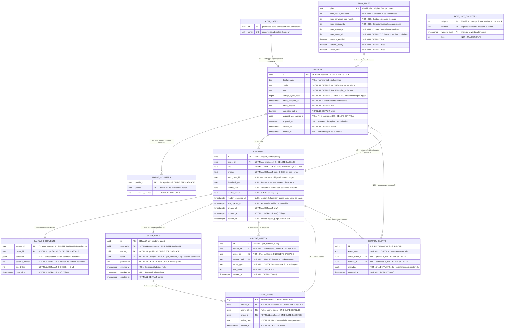

# 3. Modelo de Datos

> Modelo de datos de la plataforma de canvas colaborativo. Cubre MVP-A (canvas individual con enlace de solo lectura) y MVP-B (colaboración en tiempo real). La evolución prevista para fases posteriores se recoge en §3.8 y no forma parte del esquema inicial.
>
> **Motor:** PostgreSQL gestionado (Supabase, región Frankfurt), con Row Level Security activa en todas las tablas y extensión `pgcrypto` para la generación de identificadores.

---

## 3.0. Principios del modelo

1. **No se almacena ningún dato del invitado.** No existe tabla de invitados: ni nombre, ni correo, ni identificador persistente. Es la decisión estructural sobre la que descansa el cumplimiento normativo del producto, y explica varias de las formas que adopta el esquema.
2. **La propiedad de un canvas es inmutable.** Un canvas pertenece a quien lo creó y no se transfiere. Esto permite propagar `owner_id` a las tablas hijas con garantía de coherencia, lo que convierte las políticas de seguridad en comparaciones directas en lugar de subconsultas.
3. **Lo que se escribe mucho vive separado de lo que se lee mucho.** El snapshot del canvas se reescribe cada pocos segundos durante la edición; los metadatos se leen en cada carga del panel. Ocupan tablas distintas.
4. **Las cuotas son datos, no código.** Los límites de cada plan residen en una tabla de configuración, de modo que ajustarlos es una operación de escritura y no un despliegue.
5. **Toda tabla con datos personales declara su política de retención**, y existe un trabajo programado que la aplica.
6. **Identificadores opacos.** Claves primarias UUID en todas las entidades de negocio, para que ningún identificador expuesto en una URL revele volumen ni permita enumeración.

---

## 3.1. Diagrama del modelo de datos



### Resumen de relaciones

| Origen | Destino | Cardinalidad | Integridad referencial | Obligatoria |
|---|---|---|---|---|
| `auth.users` | `profiles` | 1:1 | `ON DELETE CASCADE` | Sí, garantizada por trigger |
| `plan_limits` | `profiles` | 1:N | Restringida: no se borra un plan con usuarios | Sí |
| `profiles` | `usage_counters` | 1:N | `ON DELETE CASCADE` | No |
| `profiles` | `canvases` | 1:N | `ON DELETE CASCADE` | Sí |
| `canvases` | `canvas_documents` | 1:1 | `ON DELETE CASCADE` | Sí, se crea junto al canvas |
| `canvases` | `share_links` | 1:N | `ON DELETE CASCADE` | No |
| `canvases` | `canvas_assets` | 1:N | `ON DELETE CASCADE` | No |
| `canvases` | `canvas_views` | 1:N | `ON DELETE CASCADE` | No |
| `share_links` | `canvas_views` | 1:N | `ON DELETE SET NULL` | No |
| `canvases` | `profiles` (atribución) | 1:N | `ON DELETE SET NULL` | No |
| `profiles` / `canvases` | `security_events` | 1:N | `ON DELETE SET NULL` | No |

Dos decisiones de integridad merecen atención. La visita cuelga del **canvas** y no del enlace, con la referencia al enlace anulable: así, revocar o eliminar un enlace no destruye el histórico de la métrica de producto. Y la atribución viral se anula en lugar de cascadear, porque el dato pertenece al perfil del usuario registrado y debe sobrevivir a la desaparición del canvas que lo atrajo.

`rate_limit_counters` es la única entidad sin relaciones, y lo es de forma deliberada: su sujeto puede ser un usuario registrado o una sesión anónima sin representación en el modelo, así que una clave foránea la haría inservible justo para el caso que más importa proteger.

---

## 3.2. Descripción de entidades principales

### 3.2.1. `plan_limits` — Cuotas y capacidades por plan

Tabla de configuración que materializa el modelo freemium. Existe para que ajustar un límite comercial sea una operación de escritura y no un despliegue de código.

| Atributo | Tipo | Restricciones | Descripción |
|---|---|---|---|
| `plan` | `text` | **PK** | Identificador del plan: `free`, `pro`, `team` |
| `max_active_canvases` | `int` | `NOT NULL` | Canvases no borrados que el usuario puede tener a la vez |
| `max_canvases_per_month` | `int` | `NOT NULL` | Cuota de creación por mes natural |
| `max_participants` | `int` | `NOT NULL` | Conexiones simultáneas por sala en MVP-B |
| `max_storage_mb` | `int` | `NOT NULL` | Cuota total de imágenes del usuario |
| `max_asset_mb` | `int` | `NOT NULL DEFAULT 10` | Tamaño máximo de un fichero individual |
| `realtime_enabled` | `boolean` | `NOT NULL DEFAULT true` | Acceso a la edición en tiempo real |
| `version_history` | `boolean` | `NOT NULL DEFAULT false` | Reservado para el historial de versiones |
| `white_label` | `boolean` | `NOT NULL DEFAULT false` | Marca blanca del plan Team |

**Relaciones:** referenciada por `profiles.plan` (1:N).

**Valores iniciales**

| Plan | Activos | Al mes | Participantes | Almacenamiento | Tiempo real | Historial | Marca blanca |
|---|---|---|---|---|---|---|---|
| `free` | 3 | 5 | 3 | 100 MB | Sí | No | No |
| `pro` | 50 | 50 | 15 | 2 GB | Sí | Sí | No |
| `team` | 500 | 500 | 50 | 10 GB | Sí | Sí | Sí |

El plan gratuito **incluye tiempo real**. Es una decisión deliberada: la métrica principal del producto son las sesiones con dos o más participantes simultáneos, y el canal de adquisición es el invitado que descubre la herramienta al recibir un enlace. Restringir la capacidad colaborativa al plan de pago apagaría ambas cosas. Lo que se limita es la escala —participantes, volumen, almacenamiento—, no la naturaleza del producto.

---

### 3.2.2. `profiles` — Anfitrión registrado

Extiende el usuario del proveedor de autenticación con los datos que gobierna la aplicación. Es la única entidad que representa a una persona: los invitados no tienen representación en el modelo.

| Atributo | Tipo | Restricciones | Descripción |
|---|---|---|---|
| `id` | `uuid` | **PK**, **FK** → `auth.users.id`, `ON DELETE CASCADE` | Mismo identificador que la identidad de autenticación |
| `display_name` | `text` | `NULL` | Nombre visible en la sesión y en los emails |
| `locale` | `text` | `NOT NULL DEFAULT 'es'`, `CHECK IN ('es','en','de','nl')` | Idioma de interfaz y de las comunicaciones |
| `plan` | `text` | `NOT NULL DEFAULT 'free'`, **FK** → `plan_limits.plan` | Plan contratado |
| `storage_bytes_used` | `bigint` | `NOT NULL DEFAULT 0`, `CHECK >= 0` | Consumo acumulado, mantenido por trigger para no recalcularlo en cada subida |
| `terms_accepted_at` | `timestamptz` | `NOT NULL DEFAULT now()` | Momento de aceptación de las condiciones |
| `terms_version` | `text` | `NOT NULL DEFAULT '1.0'` | Versión aceptada, necesaria para demostrar el consentimiento |
| `marketing_opt_in` | `boolean` | `NOT NULL DEFAULT false` | Consentimiento separado para comunicaciones comerciales |
| `acquired_via_canvas_id` | `uuid` | `NULL`, **FK** → `canvases.id`, `ON DELETE SET NULL` | Canvas desde el que esta persona llegó al producto |
| `acquired_at` | `timestamptz` | `NULL` | Momento del registro por invitación |
| `created_at` | `timestamptz` | `NOT NULL DEFAULT now()` | Alta de la cuenta |
| `deleted_at` | `timestamptz` | `NULL` | Borrado lógico previo a la eliminación definitiva |

**Relaciones:** 1:1 con `auth.users`; N:1 con `plan_limits`; 1:N con `canvases`, `usage_counters`, `share_links`, `canvas_assets`, `canvas_views` y `security_events`.

**Creación.** La fila nunca se inserta desde la aplicación: la crea un trigger sobre `auth.users`, de forma que no puede existir un usuario autenticado sin perfil. Dado que `canvases.owner_id` referencia esta tabla, la ausencia del trigger dejaría el registro completo inoperativo.

**Atribución viral.** `acquired_via_canvas_id` mide la conversión de invitado a usuario registrado sin observar al invitado. La secuencia es: la cookie de sesión de invitado ya contiene el identificador del canvas; si esa persona decide registrarse, el formulario adjunta ese identificador como metadato y el trigger lo copia a su propio perfil. El dato queda asociado al usuario **registrado**, describe su propia procedencia y desaparece si borra la cuenta. En ningún momento existe un registro del tipo "esta persona visitó este canvas" anterior a su decisión de registrarse.

---

### 3.2.3. `usage_counters` — Consumo mensual

Materializa la cuota de creación por mes natural. Un simple `count(*)` sobre `canvases` no sirve: mide canvases existentes, no creados en el periodo, y por tanto un usuario podría burlar la cuota creando y borrando.

| Atributo | Tipo | Restricciones | Descripción |
|---|---|---|---|
| `profile_id` | `uuid` | **PK compuesta**, **FK** → `profiles.id`, `ON DELETE CASCADE` | Usuario al que pertenece el contador |
| `period` | `date` | **PK compuesta** | Primer día del mes al que aplica |
| `canvases_created` | `int` | `NOT NULL DEFAULT 0` | Canvases creados en ese periodo |

**Relaciones:** N:1 con `profiles`. Clave primaria compuesta `(profile_id, period)`, que además da idempotencia al incremento mediante `ON CONFLICT`.

**Mantenimiento:** trigger `AFTER INSERT` sobre `canvases`. El contador nunca decrece: borrar un canvas libera cupo de canvases activos, no de creaciones del mes.

---

### 3.2.4. `canvases` — Sesión de trabajo

Metadatos del canvas. Fila deliberadamente estrecha, porque es la que se consulta en cada carga del panel "Mis sesiones" y la que sostiene los índices de navegación.

| Atributo | Tipo | Restricciones | Descripción |
|---|---|---|---|
| `id` | `uuid` | **PK**, `DEFAULT gen_random_uuid()` | Identificador opaco, expuesto en la URL del editor |
| `owner_id` | `uuid` | `NOT NULL`, **FK** → `profiles.id`, `ON DELETE CASCADE` | Propietario. Inmutable |
| `title` | `text` | `NOT NULL DEFAULT 'Sin titulo'`, `CHECK char_length BETWEEN 1 AND 200` | Título mostrado en el panel |
| `engine` | `text` | `NOT NULL DEFAULT 'local'`, `CHECK IN ('local','sync')` | Modo de persistencia: guardado directo o sala de sincronización |
| `sync_room_id` | `text` | `NULL` | Identificador de la sala en el servicio de sincronización |
| `thumbnail_path` | `text` | `NULL` | Ruta de la miniatura en el almacenamiento de ficheros |
| `render_path` | `text` | `NULL` | Ruta de la render que se sirve al invitado en lugar del documento |
| `render_format` | `text` | `NULL`, `CHECK IN ('svg','png')` | Formato de la render: vectorial por defecto, mapa de bits cuando el SVG resulta demasiado pesado |
| `render_generated_at` | `timestamptz` | `NULL` | Versión de la render. Forma parte de la clave de caché, de modo que cada regeneración produce una URL distinta e inmutable |
| `last_opened_at` | `timestamptz` | `NULL` | Última apertura; alimenta la política de inactividad |
| `created_at` | `timestamptz` | `NOT NULL DEFAULT now()` | Creación |
| `updated_at` | `timestamptz` | `NOT NULL DEFAULT now()` | Mantenido por trigger |
| `deleted_at` | `timestamptz` | `NULL` | Borrado lógico; purga definitiva a los 30 días |

**Restricción de coherencia:** `CHECK ((engine = 'local' AND sync_room_id IS NULL) OR (engine = 'sync' AND sync_room_id IS NOT NULL))`. Impide que un canvas quede en modo sincronizado sin sala asignada, que es el estado inconsistente que produciría una conversión interrumpida a mitad.

**Relaciones:** N:1 con `profiles`; 1:1 con `canvas_documents`; 1:N con `share_links`, `canvas_assets` y `canvas_views`; referenciada opcionalmente por `profiles.acquired_via_canvas_id`.

**Render para el invitado.** Los tres atributos de render describen la representación estática que se sirve a quien abre un enlace de solo lectura, en lugar del documento completo. La genera el navegador del anfitrión al guardar y se almacena como un fichero más. `render_generated_at` no es un dato informativo: es lo que permite tratar cada versión como un recurso inmutable y cachearlo indefinidamente sin comprometer la revocación de los enlaces, porque la caché nunca depende del token sino del contenido.

---

### 3.2.5. `canvas_documents` — Contenido del canvas

Aloja el snapshot serializado del motor de canvas. Vive separada de `canvases` porque su patrón de escritura es radicalmente distinto: se reescribe cada pocos segundos mientras alguien edita, mientras que los metadatos apenas cambian. Mantenerlas juntas provocaría reescritura constante de la fila completa, hinchazón de la tabla y degradación de los índices del panel.

| Atributo | Tipo | Restricciones | Descripción |
|---|---|---|---|
| `canvas_id` | `uuid` | **PK**, **FK** → `canvases.id`, `ON DELETE CASCADE` | La clave primaria es la foránea: impone la relación 1:1 |
| `owner_id` | `uuid` | `NOT NULL`, **FK** → `profiles.id`, `ON DELETE CASCADE` | Propietario propagado, para autorización directa |
| `document` | `jsonb` | `NULL` | Snapshot del canvas en el formato nativo del motor |
| `schema_version` | `int` | `NOT NULL DEFAULT 1` | Versión del formato, imprescindible para migrar documentos antiguos |
| `size_bytes` | `int` | `NOT NULL DEFAULT 0`, `CHECK <= 5242880` | Tamaño materializado, con tope duro de 5 MB |
| `updated_at` | `timestamptz` | `NOT NULL DEFAULT now()` | Mantenido por trigger |

**Relaciones:** 1:1 con `canvases`, garantizada por la clave primaria.

**Notas de operación.** El tope de 5 MB evita que un canvas patológico degrade la tabla; la interfaz avisa al usuario a partir de 3 MB. La tabla lleva parámetros de autovacuum más agresivos que los predeterminados, por ser la única con reescritura sostenida. En MVP-B la presión baja de forma acusada: la sala de sincronización pasa a ser la fuente de verdad y solo vuelca un snapshot cada cinco minutos y al cerrarse.

---

### 3.2.6. `share_links` — Enlace de invitado

Representa el mecanismo central del producto: acceso a un canvas sin registro, mediante un secreto en la URL. Un canvas puede tener varios enlaces activos a la vez, típicamente uno de lectura y otro de edición.

| Atributo | Tipo | Restricciones | Descripción |
|---|---|---|---|
| `id` | `uuid` | **PK**, `DEFAULT gen_random_uuid()` | Identificador interno, usado por el anfitrión para revocar |
| `canvas_id` | `uuid` | `NOT NULL`, **FK** → `canvases.id`, `ON DELETE CASCADE` | Canvas al que da acceso |
| `owner_id` | `uuid` | `NOT NULL`, **FK** → `profiles.id`, `ON DELETE CASCADE` | Propietario propagado |
| `token` | `uuid` | `NOT NULL`, **UNIQUE**, `DEFAULT gen_random_uuid()` | Secreto que viaja en la URL. 122 bits de entropía |
| `permission` | `text` | `NOT NULL DEFAULT 'view'`, `CHECK IN ('view','edit')` | Nivel de acceso concedido |
| `expires_at` | `timestamptz` | `NULL` | Caducidad opcional; sin límite si es nulo |
| `revoked_at` | `timestamptz` | `NULL` | Revocación explícita por el anfitrión |
| `created_at` | `timestamptz` | `NOT NULL DEFAULT now()` | Generación del enlace |

**Relaciones:** N:1 con `canvases` y con `profiles`; 1:N con `canvas_views`.

**Notas de seguridad.** El token es el único secreto que separa a un desconocido del contenido del canvas, por lo que nunca se escribe en registros, telemetría ni informes de error. Un enlace es válido cuando `revoked_at IS NULL` y `expires_at` es nulo o futuro; la comprobación se realiza siempre en servidor. La restricción `UNIQUE` genera el índice que sirve a la consulta de apertura, la más frecuente del flujo de invitado.

---

### 3.2.7. `canvas_assets` — Imágenes del canvas

Registro de los ficheros subidos. El contenido binario reside en el almacenamiento de objetos; aquí solo viven la referencia y los metadatos necesarios para cuotas y limpieza.

| Atributo | Tipo | Restricciones | Descripción |
|---|---|---|---|
| `id` | `uuid` | **PK**, `DEFAULT gen_random_uuid()` | Identificador del asset |
| `canvas_id` | `uuid` | `NOT NULL`, **FK** → `canvases.id`, `ON DELETE CASCADE` | Canvas que lo contiene |
| `owner_id` | `uuid` | `NOT NULL`, **FK** → `profiles.id`, `ON DELETE CASCADE` | Propietario, a efectos de cuota y autorización |
| `storage_path` | `text` | `NOT NULL`, **UNIQUE** | Ruta en el bucket privado |
| `mime_type` | `text` | `NOT NULL`, `CHECK IN ('image/png','image/jpeg','image/webp','image/svg+xml')` | Lista blanca de tipos admitidos |
| `size_bytes` | `int` | `NOT NULL`, `CHECK > 0` | Tamaño real del fichero |
| `created_at` | `timestamptz` | `NOT NULL DEFAULT now()` | Subida |

**Relaciones:** N:1 con `canvases` y con `profiles`.

**Notas.** `owner_id` se almacena aquí y no se deduce del canvas porque el trigger de consumo debe poder descontar el espacio incluso cuando la fila del canvas ya ha desaparecido en una operación en cascada. La lista blanca de tipos es la primera barrera; los SVG se sanean además en servidor antes de aceptarse.

---

### 3.2.8. `canvas_views` — Visitas seudonimizadas

Sostiene la métrica de producto durante MVP-A —canvases vistos por al menos un invitado— sin recoger ningún dato personal.

| Atributo | Tipo | Restricciones | Descripción |
|---|---|---|---|
| `id` | `bigint` | **PK**, `GENERATED ALWAYS AS IDENTITY` | Alta rotación; no necesita identificador opaco |
| `canvas_id` | `uuid` | `NOT NULL`, **FK** → `canvases.id`, `ON DELETE CASCADE` | Canvas visitado |
| `share_link_id` | `uuid` | `NULL`, **FK** → `share_links.id`, `ON DELETE SET NULL` | Enlace de origen, si aún existe |
| `owner_id` | `uuid` | `NOT NULL`, **FK** → `profiles.id`, `ON DELETE CASCADE` | Propietario, para que pueda consultar sus propias métricas |
| `visitor_hash` | `text` | `NOT NULL` | `HMAC(sal_diaria, ip ‖ user_agent)`. La sal rota cada 24 h y no se persiste |
| `viewed_at` | `timestamptz` | `NOT NULL DEFAULT now()` | Momento de la visita |

**Relaciones:** N:1 con `canvases`, `share_links` y `profiles`.

**Privacidad.** No se almacenan dirección IP, agente de usuario, nombre ni cookie de seguimiento. Como la sal no se conserva, transcurridas 24 horas el hash es irreversible incluso para quien tenga acceso completo a la base de datos. Retención de 90 días. La contrapartida, asumida conscientemente, es que no pueden deduplicarse visitantes entre días distintos: la métrica de visitantes únicos mensuales no es calculable, y ese es el precio de no almacenar ningún identificador estable de una persona no registrada.

**Escritura.** Las filas las inserta exclusivamente el backend con credencial privilegiada, porque quien origina la visita es un invitado sin identidad en la base de datos.

---

### 3.2.9. `security_events` — Traza de eventos relevantes

Registro de las acciones con implicación de seguridad, para poder reconstruir qué ocurrió ante un incidente.

| Atributo | Tipo | Restricciones | Descripción |
|---|---|---|---|
| `id` | `bigint` | **PK**, `GENERATED ALWAYS AS IDENTITY` | Identificador secuencial |
| `event_type` | `text` | `NOT NULL`, `CHECK` sobre catálogo cerrado | `share_link_created`, `share_link_revoked`, `permission_changed`, `authz_denied`, `rate_limit_hit`, `account_deleted`, `export_requested`, `plan_changed` |
| `actor_profile_id` | `uuid` | `NULL`, **FK** → `profiles.id`, `ON DELETE SET NULL` | Usuario implicado, si lo hay |
| `canvas_id` | `uuid` | `NULL`, **FK** → `canvases.id`, `ON DELETE SET NULL` | Recurso afectado, si aplica |
| `metadata` | `jsonb` | `NOT NULL DEFAULT '{}'` | Contexto adicional, sin IP, sin tokens y sin contenido del canvas |
| `occurred_at` | `timestamptz` | `NOT NULL DEFAULT now()` | Momento del evento |

**Relaciones:** N:1 opcional con `profiles` y `canvases`, ambas con anulación en cascada para que el borrado de una cuenta no destruya la traza pero tampoco la mantenga vinculada a una persona.

**Acceso:** exclusivamente desde el backend. No existe política que permita su lectura desde el cliente, ni siquiera al propietario de los recursos implicados.

---

### 3.2.10. `rate_limit_counters` — Ventanas de limitación de tasa

Sostiene la capa de limitación por sesión y por usuario. Existe porque el middleware se ejecuta en instancias efímeras sin estado compartido: un contador en su memoria no cuenta nada útil, así que debe residir en un almacén común. La limitación por dirección IP se resuelve antes, en el cortafuegos de la plataforma, y por eso ninguna IP llega hasta aquí.

| Atributo | Tipo | Restricciones | Descripción |
|---|---|---|---|
| `subject` | `text` | **PK compuesta** | Identificador del perfil o de la sesión de invitado. Nunca una dirección IP |
| `surface` | `text` | **PK compuesta** | Superficie limitada: emisión de token de sala, solicitud de subida, guardado |
| `window_start` | `timestamptz` | **PK compuesta** | Inicio de la ventana temporal a la que aplica el recuento |
| `hits` | `int` | `NOT NULL DEFAULT 1` | Peticiones acumuladas en esa ventana |

**Claves:** primaria compuesta `(subject, surface, window_start)`, que da idempotencia al incremento mediante `ON CONFLICT` y evita cualquier condición de carrera entre peticiones concurrentes.

**Relaciones:** ninguna, deliberadamente. El sujeto puede ser una sesión de invitado que no tiene representación en el modelo, de modo que una clave foránea dejaría fuera precisamente el caso que más interesa limitar.

**Privacidad.** El sujeto es siempre un identificador de sesión o de perfil, nunca una dirección IP ni un agente de usuario. Esto mantiene la coherencia con el principio de no registrar datos identificativos de personas no registradas.

**Retención.** Las ventanas caducadas se eliminan a diario. Sin esa purga la tabla crecería sin límite, ya que cada combinación de sujeto, superficie y ventana genera una fila nueva.

**Acceso:** exclusivamente desde el backend, como `security_events`. Los rechazos por límite superado se registran además como evento de seguridad, lo que permite detectar un barrido de tokens antes de que tenga éxito.

---

## 3.3. Integridad, triggers y automatismos

| Automatismo | Disparador | Función |
|---|---|---|
| Creación de perfil | `AFTER INSERT ON auth.users` | Inserta la fila en `profiles` con idioma, consentimiento y atribución tomados de los metadatos del registro. Sin él, ningún usuario podría crear canvases |
| Marca de modificación | `BEFORE UPDATE ON canvases`, `canvas_documents` | Actualiza `updated_at` |
| Consumo de almacenamiento | `AFTER INSERT OR DELETE ON canvas_assets` | Ajusta `profiles.storage_bytes_used`, evitando recalcular la suma en cada subida |
| Contador mensual | `AFTER INSERT ON canvases` | Incrementa `usage_counters` con `ON CONFLICT`, creando el periodo si no existe |
| Comprobación de cuota | Función `can_create_canvas()` invocada desde la política de inserción | Verifica en la propia base de datos los límites de canvases activos y de creaciones del mes |

Las funciones que se ejecutan con privilegios elevados se declaran `SECURITY DEFINER` con `search_path` fijado explícitamente, para impedir la captura de la ruta de búsqueda de esquemas.

Sobre las cuotas: la aplicación las comprueba antes de escribir, para poder devolver un mensaje comprensible y traducido. La comprobación en base de datos existe como segunda barrera, de modo que un fallo o un olvido en el código no pueda saltárselas.

---

## 3.4. Índices y estrategia de acceso

| Índice | Tabla | Definición | Consulta que sirve |
|---|---|---|---|
| `canvases_dashboard_idx` | `canvases` | `(owner_id, updated_at DESC) WHERE deleted_at IS NULL` | Listado del panel "Mis sesiones" |
| `canvases_purge_idx` | `canvases` | `(deleted_at) WHERE deleted_at IS NOT NULL` | Trabajo de purga diaria |
| índice de `UNIQUE(token)` | `share_links` | Implícito | Apertura del enlace por el invitado |
| `share_links_canvas_idx` | `share_links` | `(canvas_id)` | Enlaces de un canvas; borrado en cascada |
| `canvas_assets_canvas_idx` | `canvas_assets` | `(canvas_id)` | Assets de un canvas; borrado en cascada |
| `canvas_assets_owner_idx` | `canvas_assets` | `(owner_id)` | Cálculo de cuota y verificación de propiedad |
| `canvas_views_canvas_idx` | `canvas_views` | `(canvas_id, viewed_at DESC)` | Métricas por canvas |
| `canvas_views_purge_idx` | `canvas_views` | `(viewed_at)` | Retención de 90 días |
| `security_events_time_idx` | `security_events` | `(occurred_at DESC)` | Investigación de incidentes |
| `rate_limit_purge_idx` | `rate_limit_counters` | `(window_start)` | Eliminación diaria de ventanas caducadas |

PostgreSQL no crea índices automáticamente para las claves foráneas, y sin ellos tanto las verificaciones de propiedad como los borrados en cascada degeneran en recorridos secuenciales. Por el mismo motivo, no se define ningún índice adicional sobre `token`: el generado por la restricción `UNIQUE` ya cubre la búsqueda, y duplicarlo solo añadiría coste de escritura.

Las dos consultas del camino crítico deben verificarse con `EXPLAIN` en las pruebas automatizadas:

```sql
-- Panel "Mis sesiones"
select id, title, thumbnail_path, updated_at
  from canvases
 where owner_id = $1 and deleted_at is null
 order by updated_at desc
 limit 20;

-- Apertura de un enlace por parte de un invitado
select canvas_id, permission, owner_id
  from share_links
 where token = $1
   and revoked_at is null
   and (expires_at is null or expires_at > now());
```

---

## 3.5. Seguridad a nivel de fila

Regla de fondo: **las políticas de fila protegen al anfitrión; la capa de aplicación protege al invitado.** Todas las tablas tienen RLS habilitada y ninguna define política alguna para el rol anónimo, lo que equivale a denegación total. El invitado nunca alcanza la base de datos con identidad propia: sus lecturas las realiza el backend con un identificador de canvas ya verificado a partir de su token de sesión.

Gracias a la propagación de `owner_id`, las políticas son comparaciones directas contra `auth.uid()` y no subconsultas. Además de ser más rápidas, permiten auditar de un vistazo qué concede cada una.

| Tabla | `SELECT` | `INSERT` | `UPDATE` | `DELETE` |
|---|---|---|---|---|
| `profiles` | Propio | — (solo trigger) | Propio | — (endpoint dedicado) |
| `plan_limits` | Autenticados | — | — | — |
| `usage_counters` | Propio | — (solo trigger) | — | — |
| `canvases` | Propios, **incluidos los borrados** | Propio y dentro de cuota | Propio | — (purga por trabajo programado) |
| `canvas_documents` | Propio | Propio | Propio | — (cascada) |
| `share_links` | Propios | Propio | Propio | Propio |
| `canvas_assets` | Propios | Propio | Propio | Propio |
| `canvas_views` | Propios | — (solo backend) | — | — |
| `security_events` | — | — | — | — |
| `rate_limit_counters` | — | — | — | — |

Dos matices deliberados. La lectura de `canvases` incluye los borrados lógicamente, porque de otro modo el usuario no podría ver ni restaurar su papelera. Y no existe política de borrado sobre `canvases`: el borrado es lógico y la eliminación física corresponde al trabajo de retención.

### Pruebas de autorización, bloqueantes en integración continua

| Caso | Resultado esperado |
|---|---|
| El usuario A consulta canvases del usuario B | 0 filas |
| El usuario A actualiza el documento de un canvas de B | 0 filas afectadas |
| El usuario A inserta un canvas con `owner_id` de B | Error de política |
| Un usuario del plan gratuito con 3 canvases activos crea uno más | Error de política, aun saltándose la comprobación de la aplicación |
| El rol anónimo consulta cualquier tabla | 0 filas en todas |
| El usuario A lee `canvas_views` de B | 0 filas |
| Un cliente autenticado consulta `security_events` | 0 filas |

---

## 3.6. Ciclo de vida del dato y retención

| Dato | Retención | Mecanismo |
|---|---|---|
| Canvas borrado lógicamente | 30 días | Trabajo diario que elimina la fila y purga sus ficheros del almacenamiento |
| Visitas (`canvas_views`) | 90 días | Trabajo diario |
| Eventos de seguridad | 180 días | Trabajo diario |
| Ventanas de limitación de tasa | 24 horas | Trabajo diario |
| Canvas sin abrir | Aviso a los 12 meses, eliminación a los 13 | Trabajo mensual con notificación previa por correo |
| Cuenta eliminada | Inmediato | El borrado de la identidad arrastra todo el árbol por claves foráneas |

**Cobertura de los derechos del interesado**

| Derecho | Resolución con este modelo |
|---|---|
| Acceso y portabilidad | Consulta de `profiles`, `canvases`, `canvas_documents`, `share_links` y `canvas_assets` filtrando por `owner_id`, empaquetada en un archivo descargable |
| Supresión | Eliminación de la identidad, que cascadea a todas las tablas. Los ficheros del almacenamiento y las salas de sincronización se eliminan en la misma operación, con reintentos |
| Rectificación | Actualización directa del perfil |
| Consentimiento demostrable | `terms_accepted_at`, `terms_version` y `marketing_opt_in` |
| Minimización | Ninguna tabla contiene datos de personas no registradas |

---

## 3.7. Consultas de negocio

```sql
-- Metrica de producto en MVP-A:
-- canvases compartidos y vistos por al menos un invitado esta semana
select count(distinct canvas_id)
  from canvas_views
 where viewed_at >= date_trunc('week', now());

-- Activacion: porcentaje de registrados que crean su primera sesion
-- en menos de siete dias
select round(100.0 * count(*) filter (
         where c.first_canvas_at <= p.created_at + interval '7 days'
       ) / nullif(count(*), 0), 1) as pct_activados
  from profiles p
  left join lateral (
       select min(created_at) as first_canvas_at
         from canvases
        where owner_id = p.id
  ) c on true
 where p.deleted_at is null;

-- Numero medio de visitantes distintos por canvas en los ultimos 30 dias
select avg(v)
  from (
    select canvas_id, count(distinct visitor_hash) as v
      from canvas_views
     where viewed_at >= now() - interval '30 days'
     group by canvas_id
  ) t;

-- Conversion viral: porcentaje de registros procedentes de una invitacion
select round(100.0 * count(*) filter (where acquired_via_canvas_id is not null)
             / nullif(count(*), 0), 1) as pct_virales
  from profiles
 where created_at >= now() - interval '30 days';
```

---

## 3.8. Evolución prevista

El esquema admite estas extensiones sin rediseño. Se documentan para que las decisiones actuales no las bloqueen.

**Historial de versiones.** La separación entre `canvases` y `canvas_documents` es lo que lo hace barato: una tabla de versiones adopta la misma forma que la de documentos, con una fila por instantánea y retención gobernada por `plan_limits.version_history`.

**Pay-per-session.** La comprobación de cuota está encapsulada en una única función, de modo que habilitar la compra puntual consiste en añadir una tabla de bonos y ampliar esa función, sin tocar la aplicación.

**Plantillas y chat de sesión.** Tablas nuevas, sin impacto sobre las existentes.

**Facturación.** Una tabla de suscripciones vinculada al perfil, con el identificador del proveedor de pago.

**Cuentas de organización.** Es la única extensión con impacto estructural: introduciría un propietario que no es una persona y obligaría a revisar la propagación de `owner_id`. Por eso conviene no anticiparla mientras el producto se dirija a profesionales individuales.

---

## Anexo A. DDL de referencia

Las migraciones se aplican en este orden; cada bloque corresponde a un fichero en `supabase/migrations/`.

### 001 — Planes y perfiles

```sql
create table public.plan_limits (
  plan                    text    primary key,
  max_active_canvases     int     not null,
  max_canvases_per_month  int     not null,
  max_participants        int     not null,
  max_storage_mb          int     not null,
  max_asset_mb            int     not null default 10,
  realtime_enabled        boolean not null default true,
  version_history         boolean not null default false,
  white_label             boolean not null default false
);

insert into public.plan_limits
  (plan, max_active_canvases, max_canvases_per_month, max_participants,
   max_storage_mb, max_asset_mb, realtime_enabled, version_history, white_label)
values
  ('free',   3,   5,   3,   100, 10, true, false, false),
  ('pro',   50,  50,  15,  2000, 10, true, true,  false),
  ('team', 500, 500,  50, 10000, 25, true, true,  true );

create table public.profiles (
  id                      uuid primary key references auth.users(id) on delete cascade,
  display_name            text,
  locale                  text not null default 'es'
                          check (locale in ('es','en','de','nl')),
  plan                    text not null default 'free'
                          references public.plan_limits(plan),
  storage_bytes_used      bigint not null default 0 check (storage_bytes_used >= 0),
  terms_accepted_at       timestamptz not null default now(),
  terms_version           text not null default '1.0',
  marketing_opt_in        boolean not null default false,
  acquired_via_canvas_id  uuid,
  acquired_at             timestamptz,
  created_at              timestamptz not null default now(),
  deleted_at              timestamptz
);
```

### 002 — Canvases y documentos

```sql
create table public.canvases (
  id             uuid primary key default gen_random_uuid(),
  owner_id       uuid not null references public.profiles(id) on delete cascade,
  title          text not null default 'Sin titulo'
                 check (char_length(title) between 1 and 200),
  engine         text not null default 'local'
                 check (engine in ('local','sync')),
  sync_room_id   text,
  thumbnail_path text,
  render_path         text,
  render_format       text check (render_format in ('svg','png')),
  render_generated_at timestamptz,
  last_opened_at timestamptz,
  created_at     timestamptz not null default now(),
  updated_at     timestamptz not null default now(),
  deleted_at     timestamptz,
  constraint canvases_sync_coherente check (
    (engine = 'local' and sync_room_id is null) or
    (engine = 'sync'  and sync_room_id is not null)
  )
);

create table public.canvas_documents (
  canvas_id      uuid primary key references public.canvases(id) on delete cascade,
  owner_id       uuid not null references public.profiles(id) on delete cascade,
  document       jsonb,
  schema_version int not null default 1,
  size_bytes     int not null default 0 check (size_bytes <= 5 * 1024 * 1024),
  updated_at     timestamptz not null default now()
);

alter table public.canvas_documents set (
  autovacuum_vacuum_scale_factor  = 0.05,
  autovacuum_analyze_scale_factor = 0.02
);

alter table public.profiles
  add constraint profiles_acquired_via_fk
  foreign key (acquired_via_canvas_id)
  references public.canvases(id) on delete set null;
```

### 003 — Compartición, ficheros y métricas

```sql
create table public.share_links (
  id          uuid primary key default gen_random_uuid(),
  canvas_id   uuid not null references public.canvases(id) on delete cascade,
  owner_id    uuid not null references public.profiles(id) on delete cascade,
  token       uuid not null unique default gen_random_uuid(),
  permission  text not null default 'view' check (permission in ('view','edit')),
  expires_at  timestamptz,
  revoked_at  timestamptz,
  created_at  timestamptz not null default now()
);

create table public.canvas_assets (
  id           uuid primary key default gen_random_uuid(),
  canvas_id    uuid not null references public.canvases(id) on delete cascade,
  owner_id     uuid not null references public.profiles(id) on delete cascade,
  storage_path text not null unique,
  mime_type    text not null
               check (mime_type in ('image/png','image/jpeg','image/webp','image/svg+xml')),
  size_bytes   int not null check (size_bytes > 0),
  created_at   timestamptz not null default now()
);

create table public.canvas_views (
  id            bigint generated always as identity primary key,
  canvas_id     uuid not null references public.canvases(id)    on delete cascade,
  share_link_id uuid          references public.share_links(id) on delete set null,
  owner_id      uuid not null references public.profiles(id)    on delete cascade,
  visitor_hash  text not null,
  viewed_at     timestamptz not null default now()
);

create table public.security_events (
  id               bigint generated always as identity primary key,
  event_type       text not null check (event_type in (
                     'share_link_created','share_link_revoked','permission_changed',
                     'authz_denied','rate_limit_hit','account_deleted',
                     'export_requested','plan_changed')),
  actor_profile_id uuid references public.profiles(id) on delete set null,
  canvas_id        uuid references public.canvases(id) on delete set null,
  metadata         jsonb not null default '{}'::jsonb,
  occurred_at      timestamptz not null default now()
);

create table public.usage_counters (
  profile_id       uuid not null references public.profiles(id) on delete cascade,
  period           date not null,
  canvases_created int  not null default 0,
  primary key (profile_id, period)
);

-- Sin claves foraneas: el sujeto puede ser una sesion de invitado,
-- que no tiene representacion en el modelo. Nunca almacena direcciones IP.
create table public.rate_limit_counters (
  subject      text not null,
  surface      text not null,
  window_start timestamptz not null,
  hits         int  not null default 1,
  primary key (subject, surface, window_start)
);
```

### 004 — Índices

```sql
create index canvases_dashboard_idx
  on public.canvases (owner_id, updated_at desc)
  where deleted_at is null;

create index canvases_purge_idx
  on public.canvases (deleted_at)
  where deleted_at is not null;

create index share_links_canvas_idx     on public.share_links     (canvas_id);
create index share_links_owner_idx      on public.share_links     (owner_id);
create index canvas_assets_canvas_idx   on public.canvas_assets   (canvas_id);
create index canvas_assets_owner_idx    on public.canvas_assets   (owner_id);
create index canvas_views_canvas_idx    on public.canvas_views    (canvas_id, viewed_at desc);
create index canvas_views_purge_idx     on public.canvas_views    (viewed_at);
create index canvas_documents_owner_idx on public.canvas_documents (owner_id);
create index security_events_time_idx   on public.security_events (occurred_at desc);
create index rate_limit_purge_idx       on public.rate_limit_counters (window_start);
```

### 005 — Triggers y funciones

```sql
create or replace function public.handle_new_user()
returns trigger
language plpgsql
security definer
set search_path = public
as $$
begin
  insert into public.profiles (
    id, display_name, locale, terms_accepted_at, terms_version,
    marketing_opt_in, acquired_via_canvas_id, acquired_at
  )
  values (
    new.id,
    coalesce(new.raw_user_meta_data ->> 'display_name', split_part(new.email, '@', 1)),
    coalesce(new.raw_user_meta_data ->> 'locale', 'es'),
    now(),
    coalesce(new.raw_user_meta_data ->> 'terms_version', '1.0'),
    coalesce((new.raw_user_meta_data ->> 'marketing_opt_in')::boolean, false),
    nullif(new.raw_user_meta_data ->> 'acquired_via_canvas_id', '')::uuid,
    case when nullif(new.raw_user_meta_data ->> 'acquired_via_canvas_id','') is not null
         then now() end
  );
  return new;
end $$;

create trigger on_auth_user_created
  after insert on auth.users
  for each row execute function public.handle_new_user();

create or replace function public.touch_updated_at()
returns trigger language plpgsql as $$
begin new.updated_at = now(); return new; end $$;

create trigger canvases_touch before update on public.canvases
  for each row execute function public.touch_updated_at();

create trigger canvas_documents_touch before update on public.canvas_documents
  for each row execute function public.touch_updated_at();

create or replace function public.sync_storage_usage()
returns trigger language plpgsql security definer set search_path = public as $$
begin
  if tg_op = 'INSERT' then
    update public.profiles
       set storage_bytes_used = storage_bytes_used + new.size_bytes
     where id = new.owner_id;
  else
    update public.profiles
       set storage_bytes_used = greatest(0, storage_bytes_used - old.size_bytes)
     where id = old.owner_id;
  end if;
  return null;
end $$;

create trigger canvas_assets_usage
  after insert or delete on public.canvas_assets
  for each row execute function public.sync_storage_usage();

create or replace function public.bump_canvas_counter()
returns trigger language plpgsql security definer set search_path = public as $$
begin
  insert into public.usage_counters (profile_id, period, canvases_created)
  values (new.owner_id, date_trunc('month', now())::date, 1)
  on conflict (profile_id, period)
  do update set canvases_created = public.usage_counters.canvases_created + 1;
  return null;
end $$;

create trigger canvases_count after insert on public.canvases
  for each row execute function public.bump_canvas_counter();

create or replace function public.can_create_canvas(p_profile uuid)
returns boolean language sql stable security definer set search_path = public as $$
  select
    (select count(*) from public.canvases
      where owner_id = p_profile and deleted_at is null) < l.max_active_canvases
    and
    coalesce((select canvases_created from public.usage_counters
               where profile_id = p_profile
                 and period = date_trunc('month', now())::date), 0) < l.max_canvases_per_month
  from public.profiles p
  join public.plan_limits l on l.plan = p.plan
  where p.id = p_profile;
$$;
```

### 006 — Seguridad a nivel de fila

```sql
alter table public.profiles         enable row level security;
alter table public.plan_limits      enable row level security;
alter table public.usage_counters   enable row level security;
alter table public.canvases         enable row level security;
alter table public.canvas_documents enable row level security;
alter table public.share_links      enable row level security;
alter table public.canvas_assets    enable row level security;
alter table public.canvas_views     enable row level security;
alter table public.security_events  enable row level security;
alter table public.rate_limit_counters enable row level security;

create policy "perfil: leer el propio" on public.profiles
  for select using (id = auth.uid());
create policy "perfil: actualizar el propio" on public.profiles
  for update using (id = auth.uid()) with check (id = auth.uid());

create policy "planes: lectura" on public.plan_limits
  for select to authenticated using (true);

create policy "consumo: leer el propio" on public.usage_counters
  for select using (profile_id = auth.uid());

create policy "canvas: ver los propios" on public.canvases
  for select using (owner_id = auth.uid());
create policy "canvas: crear" on public.canvases
  for insert with check (owner_id = auth.uid() and public.can_create_canvas(auth.uid()));
create policy "canvas: editar y restaurar" on public.canvases
  for update using (owner_id = auth.uid()) with check (owner_id = auth.uid());

create policy "documento: leer" on public.canvas_documents
  for select using (owner_id = auth.uid());
create policy "documento: crear" on public.canvas_documents
  for insert with check (owner_id = auth.uid());
create policy "documento: actualizar" on public.canvas_documents
  for update using (owner_id = auth.uid()) with check (owner_id = auth.uid());

create policy "enlaces: gestionar los propios" on public.share_links
  for all using (owner_id = auth.uid()) with check (owner_id = auth.uid());

create policy "assets: gestionar los propios" on public.canvas_assets
  for all using (owner_id = auth.uid()) with check (owner_id = auth.uid());

create policy "visitas: leer las de mis canvases" on public.canvas_views
  for select using (owner_id = auth.uid());
```

### 007 — Retención

```sql
-- Ejecutado a diario por el planificador, con credencial privilegiada
delete from public.canvases
 where deleted_at is not null and deleted_at < now() - interval '30 days';

delete from public.canvas_views
 where viewed_at < now() - interval '90 days';

delete from public.security_events
 where occurred_at < now() - interval '180 days';

delete from public.rate_limit_counters
 where window_start < now() - interval '24 hours';
```
